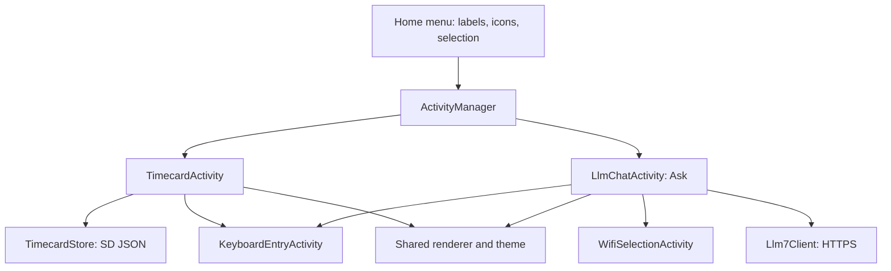

# Adding apps to T5S3-Reader

This guide documents the architecture used by **Timecard** and **Ask** (the LLM
chat app) in `michaelrolphone-cmyk/T5S3-Reader`. Source reviewed at
[`fe7e513`](https://github.com/michaelrolphone-cmyk/T5S3-Reader/tree/fe7e51306ee4e384f352f992ff4ae169fc72eef1),
2026-09-12. It describes the implementation in this fork. The inherited
`SCOPE.md` describes the upstream X4 reader mission, whereas this fork already
includes these additional apps.

## 1. Architecture and source map

Apps are C++ classes compiled into the firmware and derived from `Activity`.
There is no app manifest, dynamic loader, independently installed app package,
or central app registry in this implementation. Adding an app means adding an
activity, wiring a navigation factory, and updating the Home menu.



| Responsibility | Source | What to copy or extend |
|---|---|---|
| App interface | [Activity.h](../src/activities/Activity.h), [Activity.cpp](../src/activities/Activity.cpp) | Lifecycle, input, rendering, child results, navigation helpers |
| Ownership and navigation | [ActivityManager.h](../src/activities/ActivityManager.h), [ActivityManager.cpp](../src/activities/ActivityManager.cpp) | A `goToYourApp()` factory and include |
| Launcher | [HomeActivity.h](../src/activities/home/HomeActivity.h), [HomeActivity.cpp](../src/activities/home/HomeActivity.cpp) | Count, label, icon, index routing, open callback |
| Local app example | [TimecardActivity.h](../src/activities/home/TimecardActivity.h), [TimecardActivity.cpp](../src/activities/home/TimecardActivity.cpp) | Internal screen state and editable local records |
| Persistent model | [TimecardStore.h](../src/TimecardStore.h), [TimecardStore.cpp](../src/TimecardStore.cpp) | SD persistence separate from UI |
| Network app example | [LlmChatActivity.h](../src/activities/network/LlmChatActivity.h), [LlmChatActivity.cpp](../src/activities/network/LlmChatActivity.cpp) | Wi-Fi selection, keyboard, bounded session state |
| Network service | [Llm7Client.h](../src/network/Llm7Client.h), [Llm7Client.cpp](../src/network/Llm7Client.cpp) | Request/response model and transport separate from UI |
| Shared dialog types | [ActivityResult.h](../src/activities/ActivityResult.h), [KeyboardEntryActivity.h](../src/activities/util/KeyboardEntryActivity.h) | Cancellation and typed result payloads |
| Input | [ButtonNavigator.h](../src/util/ButtonNavigator.h), [MappedInputManager.h](../src/MappedInputManager.h) | Logical buttons, repeat navigation, mapped hints |
| Presentation | [UITheme.h](../src/components/UITheme.h), [BaseTheme.h](../src/components/themes/BaseTheme.h) | Metrics, text roles, lists, menus, `UIIcon` |
| Strings | [english.yaml](../lib/I18n/translations/english.yaml), [i18n guide](i18n.md) | Source translation keys and generated C++ strings |
| Build | [platformio.ini](../platformio.ini) | Board environments, dependencies, source inclusion |

The Ask screen was introduced in commit
[`435bdc7`](https://github.com/michaelrolphone-cmyk/T5S3-Reader/commit/435bdc70f11939ed345c18447e8ec3a6a701abae);
the Timecard screen in
[`f51bea9`](https://github.com/michaelrolphone-cmyk/T5S3-Reader/commit/f51bea93c5fee13d26fd3611a1c453294401ec4c).
Timecard's week-list/layout revision is
[`79abbd3`](https://github.com/michaelrolphone-cmyk/T5S3-Reader/commit/79abbd3a54ffffc90cff8f40e3e69d33d76f7353).
These identify screen changes; each app's integration spans the files above.

## 2. Lifecycle, ownership, and rendering

`src/main.cpp` creates the shared `ActivityManager`, renderer, and input manager.
The main loop calls `activityManager.loop()`; individual apps do not add their own
Arduino `setup()` or `loop()` entry points.

| Method or operation | Existing behavior and intended use |
|---|---|
| Constructor | Receives `GfxRenderer&` and `MappedInputManager&`; names the activity and initializes state |
| `onEnter()` | Called when a newly activated activity enters; initialize/load data and request a redraw |
| `loop()` | Handles logical button events and app actions on the main task |
| `onTouchTap()` / `onTouchSwipe()` | Handles app-specific gestures after manager-level handling; return true when consumed |
| `render(RenderLock&&)` | Runs on the separate render task, which already holds the rendering mutex |
| `requestUpdate()` | Defers notification until the manager finishes the loop iteration |
| `requestUpdate(true)` | Notifies the render task immediately; does not wait |
| `requestUpdateAndWait()` | Notifies and waits for a completed render; used before Ask's blocking request |
| `onExit()` | Called when the activity is removed; release owned resources |
| `preventAutoSleep()` | Main-loop policy hook; Ask returns `waiting` |

`goToTimecard()` and `goToLlmChat()` construct an activity with
`std::make_unique` and call `replaceActivity(..., HALF_REFRESH)` through the
manager's `kUiPageTransitionRefreshMode` constant. Replacement destroys the
current activity and clears stacked activities. Returning Home and reopening
an app therefore creates a new instance.

For dialogs, `startActivityForResult()` stores a callback on the parent and
pushes a child. **Push does not call the parent's `onExit()`; pop does not call
the parent's `onEnter()`.** The parent object remains alive on the stack.
The child supplies `setResult(...)` and `finish()`. On pop, the manager destroys
the child, restores the parent, releases the render lock before invoking its
result callback, and requests a redraw if no new transition is pending.
Do not rely on `onEnter()` to refresh state after a keyboard or Wi-Fi dialog.

Navigation is deferred through `pendingAction` and processed by the manager.
After scheduling navigation, return from the handler. Avoid queuing competing
push/replace/pop requests in one input path: there is one pending slot.

### Render-task rules for new apps

Render from state, use theme metrics and current screen dimensions, then call
`renderer.displayBuffer()`. Put storage and network actions outside `render()`.
Rendering and main-task input can overlap: protect changes to shared strings,
vectors, or models with a short `RenderLock` scope, or publish immutable
snapshots. Do not hold that mutex across slow network/storage operations.

Do not acquire another `RenderLock` inside `render()`. Never call
`requestUpdateAndWait()` from the render task or while holding the lock: the
manager explicitly asserts against both cases. The example apps do not
consistently lock all mutable state; that is a limitation of those examples,
not a guarantee that unsynchronized shared-state access is safe.

## 3. How Timecard works

`TimecardActivity` keeps three screens in one activity rather than pushing a
separate activity for every page:

- `WeekList`: 20 week choices, current week followed by previous weeks.
- `Week`: seven day rows plus four quick punch actions.
- `Day`: the selected date's four editable punches.

`activate()` routes according to `Screen`. A week selection sets `weekOffset`;
a day selection sets `editingYmd`; a day punch opens the shared keyboard.
Back walks Day → Week → WeekList → Home. Quick punches use the actual current
local date/time, then return the display to the current week, even if the user
was viewing an older week.

`editSelectedPunch()` supplies a formatted initial time, a maximum length of
12, and `InputType::Text` to `KeyboardEntryActivity`. The callback ignores
cancellation, reads `KeyboardResult`, parses the text, writes the punch, and
updates the status. Blank text clears a punch. The existing parser accepts
AM/PM or 24-hour-style input, but is permissive; use a stricter parser when a
future app requires complete input validation.

### Data contract

`TIMECARD` is the `TimecardStore` singleton. The activity loads it on entry and
again when opening a day. The store uses `HalStorage` at
`/.crosspoint/timecard.json`:

```json
{"days":[{"d":20260912,"in":480,"ls":720,"le":750,"out":1020}]}
```

| Field | Meaning |
|---|---|
| `d` | Local calendar date as integer YYYYMMDD |
| `in`, `ls`, `le`, `out` | Clock in, lunch start, lunch end, clock out; minutes after midnight |
| Missing punch | Loaded as -1; omitted when saving |

`setPunch()` finds or creates a date, clamps the minute value, keeps at most
400 vector entries after mutation, and saves immediately. Retention removes
entries from the front in insertion order; it does not sort by calendar date.
The load path does not impose that cap or validate every stored minute value.
Empty days are omitted from the saved JSON.

Time functions use `time()`, `localtime_r()`, and `mktime()`; the app does not
configure the RTC itself. Boot configures the system clock through
[`HalClock`](../lib/hal/HalClock.cpp), including the timezone. A new time-based
app should check whether the system time is valid before stamping records.
The current Timecard punch path does not do that check.

`workedMinutes()` is a helper for same-day elapsed time minus a completed lunch;
it rejects a clock-out earlier than clock-in and does not support overnight
shifts. The current screen does not use it to display payroll totals.

**Persistence caveat:** `saveToFile()` returns a success flag, but `setPunch()`
discards it and the UI displays the punch without confirming durable storage.
For new stores, propagate write failures and consider an atomic replacement
strategy supported by the storage layer. Do not advertise successful saving
merely because the in-memory model changed.

## 4. How Ask works

The menu label is `STR_LLM_CHAT` → "Ask"; the class is `LlmChatActivity`.
On entry, it requests Wi-Fi selection if disconnected. The Wi-Fi result callback
updates the status; despite the method name `ensureWifiThenAsk()`, it does not
automatically open the question keyboard. The user confirms Ask again.

The question keyboard permits 280 characters through its maximum-length
parameter. Empty submissions and cancellation are ignored. `sendQuestion()`:

1. Sets `waiting`, appends the user turn, and displays "Thinking..." using
   `requestUpdateAndWait()`.
2. Builds a system instruction plus the last four stored turns.
3. Calls `Llm7Client::complete()` synchronously on the main task.
4. Appends the assistant reply or sets an error status, clears `waiting`, and
   requests a redraw.

At most six individual turns (not six question/answer pairs) are retained in
RAM. There is no conversation file or settings store; leaving the activity
through replacement loses the conversation. A failed request leaves its user
turn in history. User text is wrapped/drawn with `TextRole::UserContent`.

### Transport boundary

`Llm7Client` accepts a vector of `{role, content}` messages and returns
`LlmChatResult {ok, text, error}`. At the reviewed source revision it uses:

| Setting | Value in the code |
|---|---|
| Endpoint | `https://api.llm7.io/v1/chat/completions` |
| Model and generation | `fast`, `max_tokens=256`, `temperature=0.3` |
| Transport | ESP-IDF `esp_http_client`, HTTPS POST, JSON |
| TLS | Roots in `LlmTlsCerts.h`; hostname verification enabled |
| Timeout | 30,000 ms per HTTP operation configuration |
| Retry | Once for `ESP_ERR_HTTP_CONNECT`, after 500 ms |
| Response accumulation | Capped at 8,192 bytes; excess bytes discarded |
| Authorization header | Literal `Bearer unused`; no user API-key setup in this app |

These are observed implementation settings, not a claim about the provider's
current service contract. On success it reads
`choices[0].message.content` and strips trailing newlines. Transport errors,
non-2xx responses, malformed JSON, and empty replies become result errors.
An oversized response may be truncated into invalid JSON rather than yielding
an explicit size error. The client temporarily disables Wi-Fi power saving and
then sets `WIFI_PS_MIN_MODEM`; it does not preserve the prior mode.

For another network app, keep transport and parsing in a service class and
keep presentation in the activity. Define response size, timeout, credentials,
and error behavior explicitly. Do not copy endpoint-specific authentication
or TLS assumptions into an unrelated service.

**Responsiveness caveat:** Ask does not use a background worker. While HTTP is
blocking, normal input, Home/global-menu processing, and the main loop are not
serviced. The busy screen and auto-sleep hook do not make the request cancellable.
Watchdog resets surround the call but are not proof against all long-call
timeouts. If a future app needs background work, add explicit task lifetime,
cancellation, power ownership, and result synchronization; do not let a worker
retain a pointer to an activity after replacement destroys it.

## 5. Adding a new app: integration checklist

### A. Create the activity and its service/model

Choose an existing category such as `src/activities/home/YourAppActivity.h/.cpp`
or `src/activities/network/YourAppActivity.h/.cpp`. Derive from `Activity`, pass
the shared renderer/input references, and implement the lifecycle and input
methods actually needed. Keep persistent records in a separate store and HTTP
logic in `src/network/`.

Use internal screen state for closely related pages, as Timecard does. Use
`startActivityForResult()` for reusable keyboard/Wi-Fi/confirmation dialogs.
Check `isCancelled` before accessing the result. For new dialog payloads, add
their struct to `ResultVariant`; for defensive handling, use `std::get_if`
instead of assuming a variant alternative. Existing builds disable exceptions.

### B. Add the manager route

Declare `void goToYourApp();` in `ActivityManager.h`, include your activity in
`ActivityManager.cpp`, and use the existing factory pattern:

```cpp
void ActivityManager::goToYourApp() {
  replaceActivity(std::make_unique<YourAppActivity>(renderer, mappedInput),
                  kUiPageTransitionRefreshMode);
}
```

This is an integration fragment; `YourAppActivity` must first be implemented.
It opens a top-level app and clears previous stacked navigation.

### C. Update every Home menu integration point together

The launcher is manually synchronized. For a new item after Timecard and before
Settings, the required changes are:

| Location | Required edit |
|---|---|
| `HomeActivity.h` | Declare `onYourAppOpen()` |
| `getMenuItemCount()` | Increase the fixed count from 6 to 7 |
| `render()` menuItems | Insert `tr(STR_YOUR_APP)` at the chosen position |
| `render()` menuIcons | Insert an existing appropriate `UIIcon` at the identical position |
| `activateSelection()` | Add `yourAppIdx = idx++` in the same order, before `settingsIdx` |
| `activateSelection()` dispatch | Match that index and call `onYourAppOpen()` |
| Callback definition | Call `activityManager.goToYourApp()` |

Preserve the optional OPDS item inserted at position 2, recent-book index
offsets, and the theme's `homeContinueReadingInMenu` behavior. Test Home with
and without recents and with and without configured OPDS servers. Changing
only the label vector can make a row open the wrong screen or make Settings
unreachable.

`UIIcon` is in `BaseTheme.h`; current apps use `Wifi` and `Clock`. Reuse an icon
when appropriate. New icons require auditing theme-specific rendering, not
just appending an enum. Some themes ignore the icon callback. Also inspect
menu capacity: the base button menu draws rows without a general app-launcher
pagination mechanism. More apps can overflow the available display height.

### D. Make touch, buttons, and drawing agree

Use `MappedInputManager` logical buttons and `ButtonNavigator`, rather than
raw GPIOs. The default navigator maps Down/Right to next and Up/Left to previous.
Map footer labels with `mappedInput.mapLabels()` and draw them with
`GUI.drawButtonHints()` so remapping and touch hints agree.

The manager handles the global top-edge drag and Home gestures before app
touch callbacks. It also intercepts footer hint taps and injects logical button
events. Do not implement a competing global gesture handler in each app.
Override `supportsGlobalMenu()` or the Home hooks only for a concrete need.
The global menu currently controls backlight/shutdown; it is not the app registry.

Compute visible rows and hitboxes from the same layout, including page/scroll
offsets. Timecard's hand-computed touch rows should not be copied blindly:
its WeekList/Day rendering delegates to themed `drawList()` implementations
whose row geometry and pagination can differ. Likewise, verify Ask's scroll
behavior before copying it: its start index begins at the tail and adds a
nonnegative offset, so it is not a general history-scrolling implementation.

### E. Add strings and build support

Add `STR_YOUR_APP` and other UI strings to English YAML, then translations as
available. Use `tr(...)`; missing non-English values fall back to English.
Generate via the normal PlatformIO pre-build step or:

```bash
python3 scripts/gen_i18n.py lib/I18n/translations lib/I18n/
```

Do not hand-edit generated I18n files. Existing Timecard/Ask code still contains
some hard-coded English labels; new apps should use translation keys for
system text and `TextRole::UserContent` for user-entered or remote text.

The current source filter includes source files under `src` automatically
except AppleDouble files. No per-app build registration is required. Add
dependencies to `platformio.ini` only when needed, and isolate board-specific
hardware through existing Board/HAL boundaries. Both apps are currently wired
without board-specific launcher guards.

## 6. Verification and release

For future implementation changes, build both supported development targets:

```bash
pio run -e t5s3-pro
pio run -e lilygo-epd47-s3
```

Use `pio run -e gh_release` when validating the release configuration. The
existing CI also runs streaming-JSON and release-JSON host parser tests; those
do not establish correctness of a new app's persistence or service parser.
Add focused tests for new parsing/data behavior where failures matter.

On-device checks should cover launcher routing across themes, touch/button
equivalence, keyboard cancel/submit, Back and Home, global-menu dismissal,
sleep/wake, and repeated entry/exit. For storage apps, check failed writes and
reboot persistence. For network apps, check disconnected Wi-Fi, cancellation
of connection selection, service errors, bounded responses, and resource
cleanup. For date apps, test unset time, timezone changes, and day boundaries.

Build success cannot verify touch geometry, e-paper refresh quality, RTC
correctness, or network behavior on hardware. This document was reviewed
against source; documenting the architecture did not exercise either app on
a device or call the remote LLM service.

Publish firmware only when requested, using [RELEASING.md](RELEASING.md) and
[AGENTS.md](../AGENTS.md). A documentation change does not need a new release.

## 7. Optional next architectural step

If the app count grows, a shared descriptor list containing a label ID, icon,
visibility predicate, and launch callback would let Home derive its count,
rendered entries, and dispatch from one source. Pair that with shared menu
layout/hit-testing and scrolling. This would remove the current manual-index
coupling. It is a proposed improvement, not an existing app-registration API.
