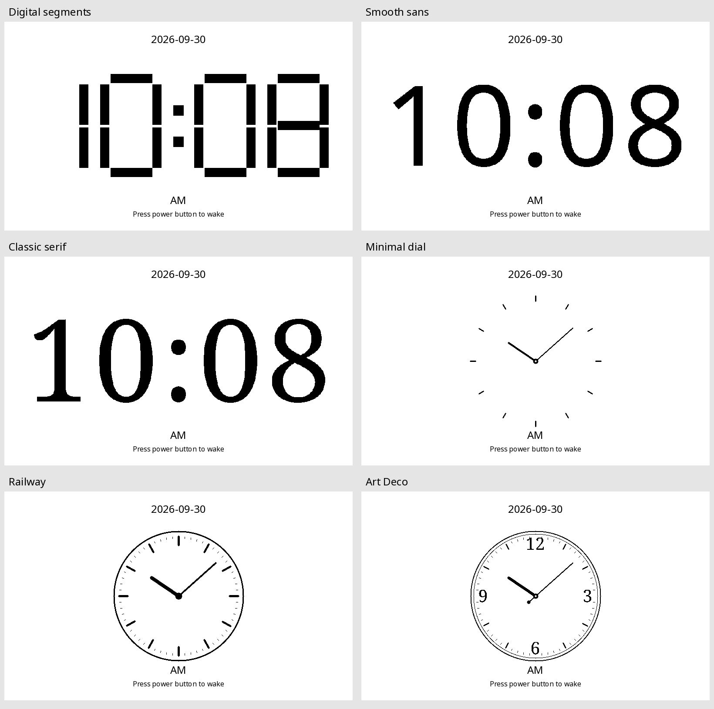

# Desk clock faces

In **Settings → Display**, set **Sleep screen → Desk clock**, then choose
**Clock face**. The choice is saved and used the next time the device sleeps.
The time format still follows the existing 12/24-hour setting.

- **Digital segments**: the original large segmented display (default).
- **Smooth sans**: large Noto Sans numerals.
- **Classic serif**: large Noto Serif numerals.
- **Minimal dial**: twelve floating markers and slender hands.
- **Railway**: minute track, strong hour markers and bold hands.
- **Art Deco**: double border, serif quarter numerals and counterweighted hand.

The face pixels above are generated by the production renderer at 800×480;
preview date/wake captions approximate the firmware's UI font. The same layout
also supports the 960×540 panel. Analog hands advance each minute; the hour hand
includes the minute offset. There is no second hand or continuous animation.

All faces use the existing deep-sleep minute timer, power-button wake, retained
previous-minute reconstruction, differential refresh and periodic full refresh.
The selected face is copied into RTC retention before sleeping. Its layout
version changes from CLK2 to CLK3, so older retained data cannot be misread.
Invalid time shows dashes and the existing set-time message, never plausible
analog hands. Invalid face settings fall back to Digital segments.

Only the firmware changes (1.3.46 → 1.3.47); no app/driver update is needed.
Digits are flash-resident scanlines from the repository's SIL OFL Noto Sans and
Noto Serif Regular fonts. They need no SD mount, font service or dynamic font
allocation on minute wakes. Regenerate with `python3 scripts/generate_clock_digits.py`
(Pillow required). Numeric geometry remains pure 1-bit to preserve the existing
clock refresh path.

Checks: `bash test/run_desk_clock_test.sh` covers existing timing/wake/diff guards
and production face rendering for all 1,440 minutes, both time formats and both
panel sizes, including invalid time and unknown face fallback. Recreate this
sheet with `python3 scripts/preview_clock_faces.py` (Pillow required). Hardware
appearance and current draw have not been measured for these new faces.
