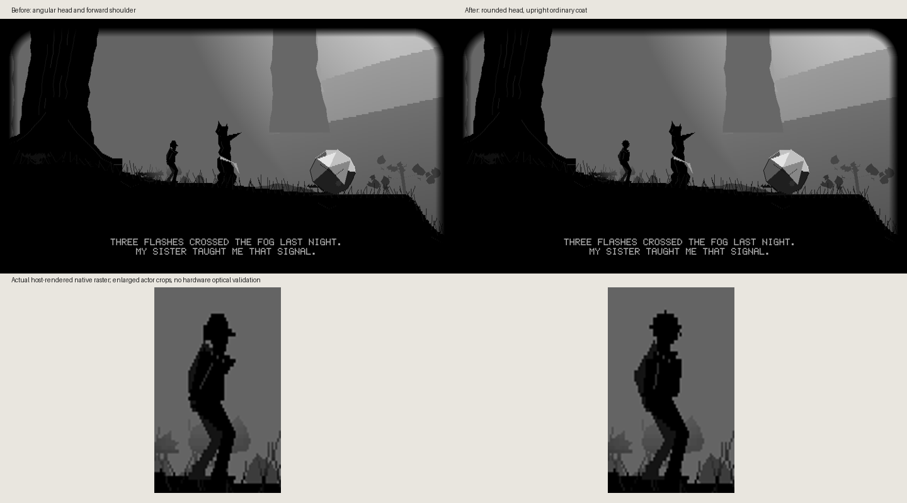
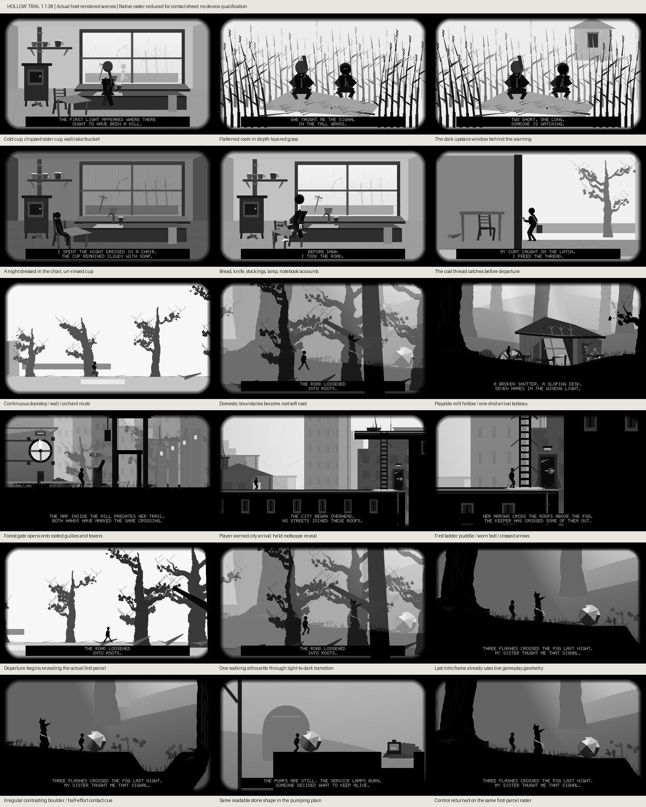

# Hollow Trail 1.1.38: readable contact and continuous departure

This focused continuation starts from merged PR #335, master `a5e2db59`.
The separate, unfinished schoolroom continuation is not included.

These are host-rendered native rasters. The contact sheet alone is reduced for
layout; game resolution remains unchanged. They do not validate panel ghosting,
optical contrast, physical FPS or controller feel. The comparison includes an
enlarged crop of the actual actor, not concept art.

## Changes

- Pushable stones have a chipped asymmetric twelve-point contour, a light upper
  facet, dark lower facets and a contact shadow. The stable contact envelope and
  rolling physics are unchanged. Fracture marks still follow travelled arc length.
- Walking into a grounded pushable produces exactly half the displacement of
  its active contact pose. This is draw-only state: it cannot move a crate/stone,
  charge the fallen-tree action, unlock a crossing or grant evidence. Releasing
  direction removes it. Full pushing still requires the existing grab action.
- The traveler has a rounded head, restrained profile, ordinary soft coat and
  more upright shoulders. The novella's coat is retained without adding costume
  lore; limb contact targets, movement timing and collision geometry are retained.
- The final 260 ticks of the house/orchard walk reveal the actual first forest
  parcel. A single actor remains visible while the light scene becomes the dark
  forest. The last 30 ticks already use the live renderer. The exact final game
  state, camera, actor pose and narration continue after handoff. No level-reset
  title/instruction card replaces the scene, and held input must return neutral.
- Narration gains two logical pixels of padding above and below (four physical
  pixels each). Its black strip can receive two additional black-endpoint passes
  on text changes, without repacking or redrawing the full game for those passes.

## Firmware dependency and compatibility

Hollow Trail: **1.1.36 → 1.1.38**. Version 1.1.37 is reserved by the independently
owned, unpublished U1 ZIP migration; the version gap was coordinated with that
owner. Published release-index was checked and contains Hollow Trail 1.1.36.

Firmware: **1.3.47 → 1.3.48** for the optional additive video hook. Master and
published firmware were both 1.3.47 when this increment began. This changes source
versions only; no release, tag, index mutation, merge or flash is part of this PR.

The app retains minimum firmware 1.3.37. On older firmware its visual, padding,
contact and departure changes work; **the extra black-strip pulses require
firmware 1.3.48 containing this implementation**. The app checks API struct size
and function availability and logs when unavailable. Repeated ordinary submits
cannot substitute for the hook: the existing mono converter skips settled pixels.

The generic hook accepts at most 64 physical rows and two passes, is mono-only,
replaces rather than queues requests, and expires after sixteen scan opportunities.
Hollow requests rows 460–505 only when submitted narration text changes; leaving
narration cancels it. The scan task owns its finite per-row state. Normal settling
commands win. White pixels are not reinforced. The hook neither swaps buffers nor
changes frame admission/completion or app lifetime. No game-specific policy enters
the backend, and no global idle-cleanup timing is weakened.

## Verification

- Actual host rasters were inspected, including enlarged actor comparison and
  departure at ticks 2020, 2140, 2279 and the live handoff at 2280
- Both-raster exact final-image equality includes narration; a separate actor
  presence check prevents two empty backgrounds from satisfying continuity
- Input tests cover held-input neutral gating and exit during the transition
- Draw-only half-effort pose, tree collision/release, complete ten-chapter input
  route, evidence, ground contacts and existing boat/grotto regressions are covered
- Backend tests cover region bounds, two-pass termination, cancellation/replacement,
  deadline, black-only pixels, normal-transition priority and unchanged admission
- App pipeline tests exercise requests on actual accepted submissions, not a
  stand-alone model, with bounded region/pass count
- Full aggregate host suite and target ELF/sidecar/catalog build results are
  recorded in the PR alongside exact-head firmware CI

The current 44-scene novella map remains in `HOLLOW_TRAIL_NOVELLA_ALIGNMENT.md`.
Rain tank, signal-room staging, later chapter layouts and the missing final-door
ending remain later work. This PR does not claim whole-novella completion.

## Follow-on source-scan revalidation

The [21:12 legacy scan](https://github.com/michaelrolphone-cmyk/T5S3-Reader/blob/a0478d0b443169704a251b5df4543ceb0fea5378/bugs.md)
was rechecked against PR #336 head `f55e4b2f`, rather than treating its local
numbers 258–260 as canonical ledger IDs or its stale open-PR assertion as fact.

- Scan-local 258 (arrival-frame residue) is false on that head and scanned master:
  traversal invokes the full forest/city backdrop, including full-raster cache
  copies. A runtime probe compared zero/255 prefills across 92 sampled mill/city
  frames in both output resolutions; every resulting image matched. Existing
  cutscene tests now retain this prior-raster-independence check.
- Scan-local 259 (Y mapped to X) reproduced through both real provider mapping
  paths and the app scheduler: ordinary/X/Y walk acceleration was 48/53/48.
  A dedicated Y action bit now gives 48/48/53, retaining X solely as Back. Tests
  cover release, re-press, and suppression while paused, reading or in a cutscene.
- Scan-local 260 (inactive 960x270 mode) is false: the production traversal pass
  already enables the half-height flag, including on scanned master. An actual
  render observed 103 full-height and 13 half-height cooperative checkpoints.
  The renderer regression now observes both stages via its existing service
  callback. No renderer implementation or resolution was changed for this claim.

These checks establish software behavior, not physical controller-label or
panel qualification. PR #336 was owner-merged during revalidation. The narrow Y correction is a
separate continuation, Hollow Trail 1.1.38 → 1.1.39; firmware remains 1.3.48.
