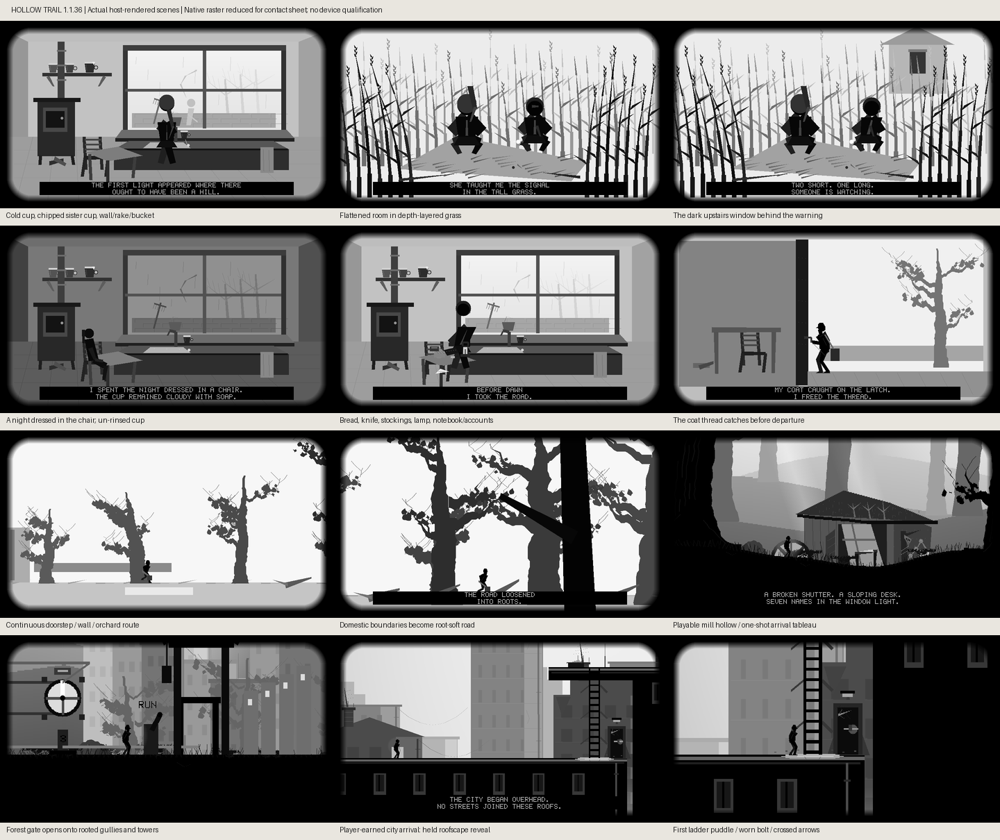

# Hollow Trail: novella alignment, 1.1.36

This is an implementation map, not a claim that the 44-set direction is complete.
The novella remains the narrative source; `HOLLOW_TRAIL_PLAYABLE_SCENES.md` remains
the composition target. Existing ten-chapter traversal, boat quality, 960×270
foreground option, Y emphasis and #331's slower introduction are retained.

## This PR: inspect the actual pixels

These are actual game-raster frames, not generated concept art. Native 960×540
frames are reduced only to fit this contact sheet. [Packed kitchen dots](previews/hollow-trail-kitchen-mono.png)
and [packed mill dots](previews/hollow-trail-mill-mono.png) show the real mono packer
output. These do not measure panel appearance, ghosting, current draw or FPS.
Regenerate with `python scripts/preview_hollow_trail_story.py` (host C compiler,
Pillow); individual grayscale and mono PNGs go to `dist/story-previews/`.

- Kitchen rebuilt at human scale: wet pane/wiped crescent, local reflected light,
  garden wall/rake/bucket/fading apple branches, chipped cup and empty handle space,
  stove/crossed slippers, basin, soap-marked un-rinsed cup, table and chair
- Grass memory becomes an enclosed, flattened room, with continuous depth-lagged
  wind, bent stems, crouched sisters, small mirror, seed/pod detail and the dark
  upstairs window in the warning memory
- A separate overnight chair hold precedes packing. Bread, knife, stockings,
  pantry lamp, notebook and discarded account paper are staged on the table
- A close latch insert shows the caught thread and hand releasing it before the
  existing continuous profile walk. Intro is now 2,280 × 32 ms = 72.96 seconds;
  captions retain a minimum 4.8-second hold
- Chapter I's mill/register now occupies the actual low hollow at X≈1,095–1,268.
  The register interaction moves from the unrelated stump at X=1,415 to the
  sloping desk at X=1,180 on terrain parcel 3. No new invisible platforms
- Natural grounded arrival near X=1,070 triggers a 10.88-second mill tableau:
  a quiet pullback reveals the still wheel, sagging roof, gutter saplings,
  wet footing/pool, broken shutter/window beam and desk, then restores framing. A bounded follow-up adds sagging
  eave sections, missing tile ends, water-darkened split board feet and rooted
  fern/ivy detail to the same mill, without changing contact surfaces
- This second in-engine cutscene never grants evidence, solves a puzzle or
  respawns the player. It preserves the complete gameplay state and runs once
  per app session; neutral input is required afterward. Debug jumps do not
  manufacture an arrival. It leaves subsequent play in the player's hands

## Same-PR continuation: forest gate and city threshold

After the intro/mill checkpoint passed exact-head CI, this increment connects
sets 7–8. Towers and living gullies are world anchored beyond the forest gate;
they enter through clipping rather than popping in at an actor threshold. The
first city terrace gains standing water around the ladder's bottom rung, a rubbed
bolt/thumb patch and competing charcoal arrows, plus chimney cage/nest and a
shallow reflecting tank on the first roof. The reveal opens toward that first
ladder/door, with bent aerials, chimney cages, sagging cables fading into fog,
coping courses, drain seams, split plaster and restrained soot/flashing. These
are fixed world details; no new surfaces or collision shortcuts are implied.

A third in-engine tableau runs only after actual gameplay solves and exits the
forest gate into the city. It holds/pulls back through the existing roofscape,
then returns to the same spawned city state with a neutral-input gate. It does
not solve the forest puzzle, automatically climb the ladder or substitute for
city exploration. Later chapter jumps do not trigger it; it is once per session.

## Scene-by-scene remaining map

“Partial” means there is relevant source/gameplay/art, not full novella parity.
All remaining entries need their own coherent increments, visual inspection,
contact/route regressions and versioned deliverables. Do not replace normal
traversal wholesale with autoplay.

| Set | Current alignment | Concrete next work |
| --- | --- | --- |
| 1 Kitchen | Implemented visual increment | Refine hand/cup contact and window reflection against owner feedback |
| 2 Grass memory | Implemented visual increment | Wrist/knuckle interaction and more natural close facial silhouettes |
| 3 Departure/orchard | Implemented thread/packing/night beats; continuous route retained | White chimney's final bank occlusion, alder ditch/bronze leaves, animate chair tuck |
| 4 Marked forest | Partial: rooted terrain, monumental trunks, cloth evidence | Join older bark cut/date/socket to the cloth; local inspection framing |
| 5 Fallen-tree hollow | Existing resisted push and gravity fall retained | Saw/root detail and bounded settling debris; tune effort only with route evidence |
| 6 Mill hollow | Implemented exterior/desk placement and arrival tableau | Broken-shutter entry and a player-moved desk exposing the register's ink |
| 7 Ravine/clearing/gate | Existing branch/rope/bell/gate; new layered skyline and earned city tableau | Extend clearing terrain/large vista and refine gate spatial continuity |
| 8 Service terrace | New ladder puddle, rubbed bolt/arrows, cage/nest/tank and held city arrival | Extend abandoned terrace materials and continuous onward roof route |
| 9 Schoolroom | Partial: city evidence exists | Actual child desks/map room with visible matching route landmarks |
| 10 Rain tank/crossings | Existing roofs and rain | Tank refuge, meaningful opposite-window sightline, brief submerged street glimpse |
| 11 Signal room/relay | Existing relay/log puzzle and narrative | Empty chair/automated wheel staging; reveal rather than assume mechanism |
| 12 Pump plain | Existing stopped pump silhouettes | Place service lamps and retain exposure/empty horizon |
| 13 Tank basin/cut | Existing tanks/terrain/stone | Close curved-wall occlusion, eroded culvert and connected underground pipe routes |
| 14 Stove shed | Narrative fragment only | Cold ordered interior, wrapped pipe, dish rings responding to knocks |
| 15 Distribution | Existing vessel puzzle/evidence | Physical paired lists/eighth line and progressive steady lamp line |
| 16 Carriage/rail dawn | Existing train/yard art | Wheel-less sleeping carriage and coherent dawn reveal |
| 17 HOME ticket | Existing ticket evidence | Station benches/window with blocked cutting and three comparable dates |
| 18 Trestle/cabin | Existing crossing/route puzzle | Under-track bracing route, wool contact and five-legged dog at lever |
| 19 Shunting/marsh | Existing three-wagon puzzle | Distinct heavy bodies and continuous ballast-to-reed terrain transition |
| 20 Ferry | Existing approved boat/grotto retained | Far-bank canvas/person ambiguity and pulling boat to shore; preserve hull quality |
| 21 Marsh path | Partial wet terrain/depth | Raised bank with transparent/mirrored water and quarry sightline |
| 22 Waiting awning | Existing rope/log evidence | Chair/stick groove, scuffs and one unanswered bell response |
| 23 Locks | Existing water-level puzzle | Ground cradle/ladder/watermarks and vertical camera relation |
| 24 Quarry reveal | Partial chapter transition | Backward marsh vista, progressive pale escarpment approach |
| 25 Quarry floor | Existing terrace/crane/stone detail | Monumental cut scale, chisel/spoil and human-sized stone-groove staging |
| 26 Quarry ascent | Existing ladders/ledges | Cloth boundary/small bootprints and recognizable distant travelled country |
| 27 Hoist | Existing balance puzzle | Scarf grip, cage boarding/descent and fern passing the face |
| 28 Gallery | Not a distinct set | Narrow wet gallery giving way continuously to fern/glasshouse ribs |
| 29 Living beds | Existing glasshouse/plant detail | Maintained rows, broken-pot shelter, watering channels and gentle contact response |
| 30 Sleeping/lock | Narrative fragment only | Seven pallets, privacy curtain, internal lock/wedge, light removed by door |
| 31 Garden night/counts | Existing evidence | Still pallet shot and physically aligned duplicate marks/drawings |
| 32 Mirror partition | Existing mirror/vent puzzle | Moisture-clearing beam path with plant response and cold exterior reveal |
| 33 Dam reveal | Existing detailed dam/falls retained | One coherent monumental reveal, turbine gauge/shared-feed diagram |
| 34 Service ledges | Existing climb route | Route-aligned buttress occlusion, sheltered wet rock and landing sightline |
| 35 Reservoir | Existing boat/waterfall benchmark retained | Authored gust/bag/oar recovery only with reviewed boat/contact regressions |
| 36 Storm galleries | Existing weather/rope/valve narrative | Physical paper comparison and one hard lightning shadow, no blanket strobe |
| 37 Recorder/distributor | Existing power puzzle/evidence | Manual in dry cabinet, return warming cue and tiny mast exit vista |
| 38 Shelter/ascent | Existing snow/rock/tree gradient | Shelter/ice basin and route-specific vegetation reduction |
| 39 Scarf panorama | Existing scarf and mountain route | Interconnected backward country, then continuous sleet visibility contraction |
| 40 False signal | Existing return-isolation/chime puzzle | Stop the actual flashes and hold the silver contact gap before traversal resumes |
| 41 Settlement | Existing houses/mast | Connected alleys/retaining walls, mundane occupancy traces, ambiguous windows |
| 42 Tower | Existing climbing/channel boat | Eight hooks/bench, older masonry and visibly steadier boat handling |
| 43 Cabinet | Existing exclusive choice and testimony | Modest literal room, physical evidence floor, shutters/lamps/pantry-lamp sequence |
| 44 Final door | Missing; game still loops after final chapter | Dedicated unwired street, shoes, notebook, unpatterned knock and static waiting end |

## Next coherent increments

1. Finish Chapter I's mill interaction and clearing terrain without
   replacing tree/rope gameplay; use the new timeline where stillness aids story
2. Build the schoolroom → rain tank → empty signal-room sequence as connected
   city spaces, preserving existing traversal and player-operated relay
3. Continue chapter-by-chapter. The last-door ending is an explicit missing
   product outcome, not something the existing ten-chapter loop already proves

## Verification record

Version: Hollow Trail 1.1.35 → 1.1.36, minimum firmware unchanged at 1.3.37.
Published release-index was read before this bump and confirms 1.1.35.
Host previews were inspected and corrected: initial latch arm targeted the wrong
projected coordinates; final version targets the actual latch using the shared
articulated pose. The forest/mill middle-view and three city-view goldens change; the other
26 complete renderer references, including all boat/dam references, stay exact.

Local targeted timeline, input, full-route and Xtensa app results plus aggregate
and CI status are recorded in the PR. No hardware appearance/FPS claim; no merge,
release, catalog change or flash. The full novella map remains incomplete.
