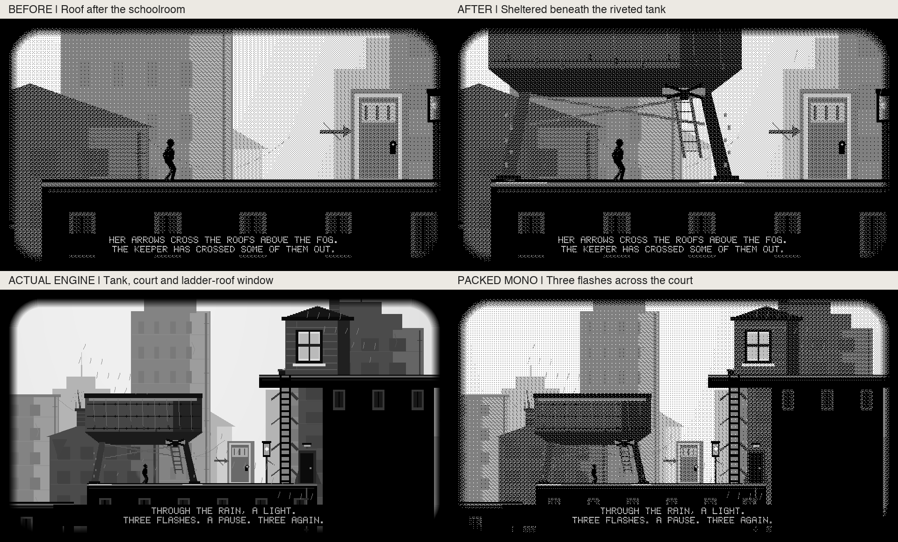

# Hollow Trail 1.1.45: shelter and the opposite light

Novella Chapter II puts the refuge after the burnt fuse and before the empty
signal room. The existing city route now has a riveted iron tank, rusted feet,
rear bracing, dripping belly, reflected footings and a service ladder ending at
a chained underside hatch. It stands on the existing sixth upper-route parcel
at X=1840, Y=70. It adds no collision surface or new traversable ladder.

A window on the actual next ladder's upper roof repeats three short flashes
and a pause. A natural forward grounded crossing beneath the tank earns one
13.44-second arrival tableau: pull back/up to reveal the tank, court, climbing
route and window together, hold the sightline, then restore the original camera.
Rain and the lamp animate while the complete gameplay snapshot stays frozen.
No evidence is granted, puzzle solved, character repositioned or route skipped.

The scene occurs once per app session. Teleports/chapter jumps, reverse travel,
airborne passes and traversal attachments do not trigger it. Held controls are
suppressed, a neutral report is required afterward, and host exit remains
available. Existing X Back, Y motion emphasis, A inspect, journal and schoolroom
controls are retained. The camera/caption strip uses the established renderer.

The underlying renderer, PSRAM allocation repair, surface geometry, movement,
other chapters and firmware are unchanged. Drawing uses bounded, culled scene
primitives and service checkpoints, without new buffers or per-frame allocation.
The nine other chapters, existing 30 renderer references and 300 independent
grotto references remain protected by their existing checks.

## Version and scope

Master/package lineage at start: 82caa099 and published index 5caf9b7f both use
Hollow Trail 1.1.44, including U1's ZIP transition and PR352 startup repair.
This app-only increment is **1.1.44 → 1.1.45**; minimum firmware remains 1.3.37.
No firmware/package-runtime architecture or hardware work is included.

This completes the tank/sightline portion of set 10. The submerged street glimpse,
empty signal-room mechanism/log inspection and later sets remain future work.
Host grayscale/packed mono images are actual engine output, not physical panel,
ghosting, optical contrast, controller-label or device-FPS qualification.

## Verification

The PR records exact source SHA, matching-head CI and build evidence. Focused
controller cases exercise natural entry, frozen state, held A/B/Y/direction,
provider failure/recovery, neutral handoff, non-replay and host interruption in
both raw controller sources. Scene tests cover rejected arrivals, all phases in
both raster modes, prior-buffer independence, unchanged gameplay and the exact
three-pulse cycle. Full route, startup/pipeline and renderer references remain
part of the normal aggregate. `scripts/preview_hollow_trail_story.py` regenerates
the current native gray and mono scene rasters.

Ownership: task-2 owns this increment until the PR checkpoint claim is released.
No merge, release, live catalog change or device action is authorized here.
