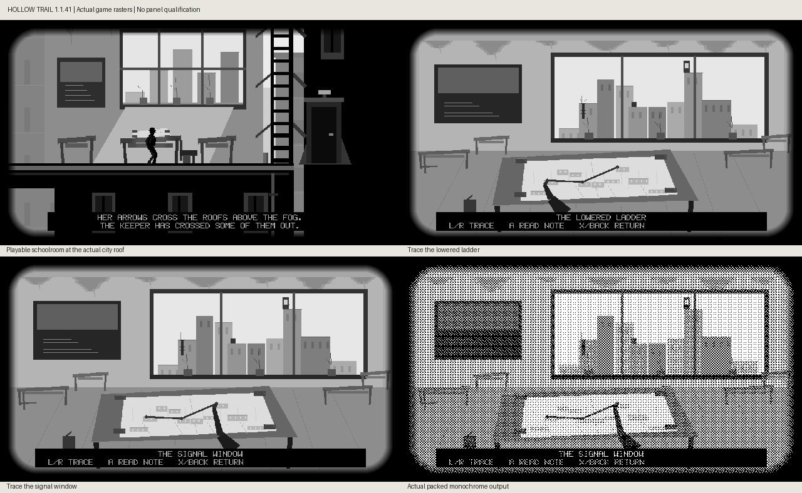

# Hollow Trail 1.1.41: the schoolroom and rooftop map

These are actual host-rendered game rasters, including packed monochrome output;
the contact sheet is resized for layout. They do not measure panel ghosting,
optical contrast, controller labels or device FPS.

## Source and implementation

Novella Chapter II places the schoolroom on the top floor: damp ceiling,
undersized desks, a half-erased board, dead stems, and the sister's folded route
map held by four bricks. This continuation reuses the preserved schoolroom work
and connects it to the existing city roof at X=535, Y=80, rather than inventing
new collision surfaces or replacing traversal with an automatic sequence.

- The actual walkable schoolroom has desks, window light, dead stems, board,
  ceiling stains, a bag/chair and a brick-weighted map on the evidence desk
- A inspects the map and opens a still, first-person study composition. Left/right
  traces the lowered ladder, crate crossing and signal-window route anchors
- Both the miniature roofscape through the window and the printed map derive
  their positions from the existing city platforms and mechanics. The selected
  map point and matching roof sight mark move together
- A or Start opens the existing schoolroom note; X/Back returns to the same
  player state. Held entry/exit buttons cannot accidentally trigger another
  action. Reading, tracing and repeat inspection never solve the relay or move
  the player, bodies or camera
- Study captions use the narration strip's two-pixel padding and optional
  bounded black reinforcement from firmware 1.3.48. Gameplay FPS accounting
  pauses while studying and resets on resuming

The interaction is opt-in and repeatable. Existing movement timing, ladders,
physical footing, ten-chapter route and boat/grotto rendering remain intact.
The room is a focused implementation of set 9, not completion of the whole
novella: subsequent rain-tank crossings, signal-room staging and later sets
remain on the scene map.

## Versions and branch boundaries

Hollow Trail **1.1.38 → 1.1.41** against the merged mechanics baseline.
Version 1.1.39 is the separate Y-emphasis correction in PR #339; 1.1.40 is reserved
for U1's ZIP transition. This PR does not stack those development branches.
Merge the correction first and reconcile before merging/releasing this scene so
no later integration drops its mapping or lowers the app version. Firmware
remains unchanged at 1.3.48; minimum firmware remains 1.3.37.

## Evidence and limits

- Actual exterior, ladder-focused and signal-focused study frames inspected in
  grayscale and packed monochrome; ceiling/desk details revised after review
- Both raw controller sources tested for entry, frozen game state, held-direction
  suppression, focus wrapping, return/re-entry, neutral-input gate, note opening
  and host exit. Existing journal navigation remains covered
- Both output rasters tested for all focus states, independence from prior
  framebuffer contents, correct actual evidence height and route-derived anchors
- Existing baseline goldens remain unchanged; the new schoolroom views have
  dedicated coverage rather than replacing unrelated golden references
- Full aggregate, Xtensa/ELF/version agreement and exact-head CI outcomes are
  recorded in the PR. Physical panel and hardware interaction are unverified

No merge, release, catalog publication or flashing is part of this work.
