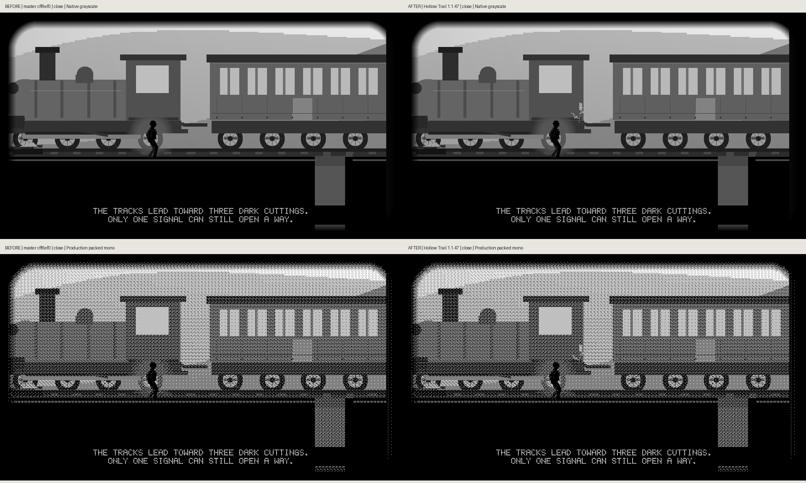
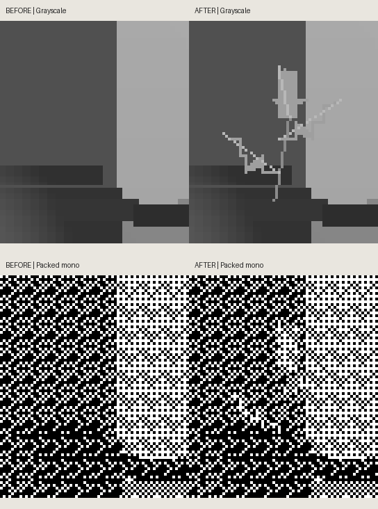
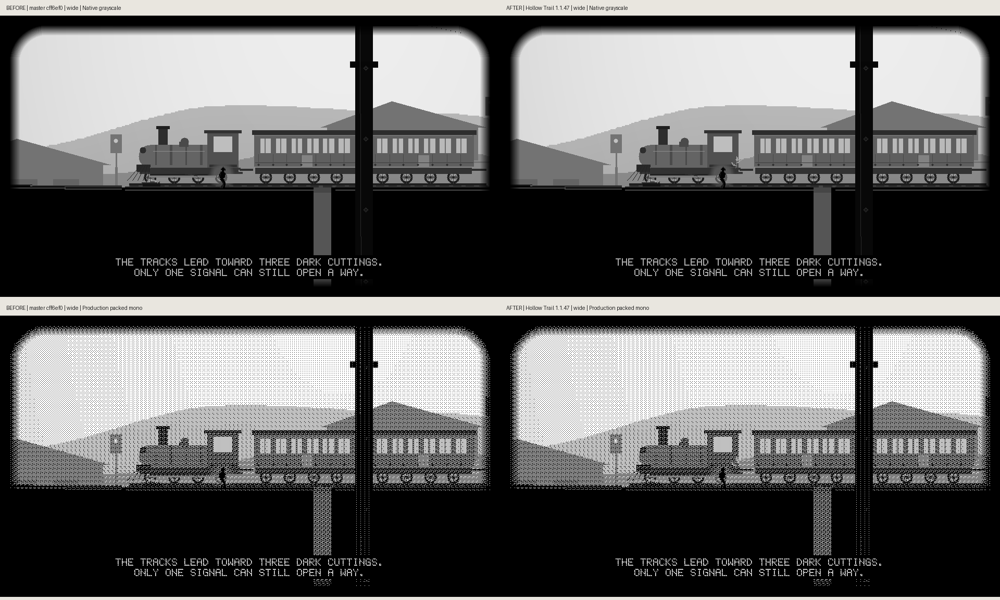

# Hollow Trail: the three-leaf cab-step plant

The novella's Chapter IV specifies: “A plant had reached the cab step: three leaves on an iron tread made for a boot.” [Source, line 579](../../HOLLOW_TRAIL_NOVELLA.md#L579).

The existing locomotive drew bare iron treads. This bounded update roots one stem and three filled leaves on its existing upper tread, using `ht_limb` and `ht_detail_leaf` in `ht_scene_geography`. Locomotive geometry, tracks, terrain, collision, camera, pacing, narrative and other chapters are unchanged. Hollow Trail advances **1.1.46 → 1.1.47**; firmware and minimum firmware stay unchanged. This does not implement the still-missing sleeping-carriage scene.

## Inspect the actual raster

The scene pairs retain native 960×540 pixels. The detail image is only a labeled crop of those same pixels, magnified with nearest-neighbor sampling; it is not separately rendered or illustrated. Original frames and their SHA-256 hashes are recorded in [capture metadata](capture-metadata.json).

## Reproduction and scope

Run `python scripts/preview_hollow_trail_story.py --cab-step --output dist/cab-step-previews` on the candidate. For the baseline use the same updated preview harness against unchanged master **cff6ef0c11b79634dfa2c688d880df393d8c153c**. The only harness difference is the source repository root. All 85 local Hollow Trail app/story/preview/native-test source files were verified against that master tree before editing.

Both captures use the real engine, native camera mode, level 3, world actor (760,220), camera (560,40), tick 0 and grounded state. Close uses intimacy 256/vista 0; wide uses intimacy 0/vista 256. The existing narration pass is retained. Packed mono is the production `ht_pack_mono` output, 120 bytes per row. Compiler and exact after-source blob IDs are in the metadata.

The complete before/after differences stay inside the plant's projected footprint: close grayscale 280 pixels, close mono 82 pixels; wide grayscale 84 pixels, wide mono 36 pixels. No scene pixels outside those small rectangles change.

## Regression evidence

The new focused cases in `hollow_trail_renderer_test.c` fail unchanged master at the first missing-leaf assertion. The candidate checks all three leaf tips separately, roots the stem on the original tread, preserves the game state, and covers baseline/full-native raster modes at two projection scales, plus an extra half-height robustness case (current production geography is drawn before half-height foreground is enabled). Each leaf tip must also survive production mono packing relative to iron-tone fill in the isolated geography pass. The full composed previews provide the separate visual readability check; individual leaves remain subtle at wide mono framing. The existing 30 whole-scene/packed golden pairs remain unchanged, including forest, city and boat.

These are host-rendered pixels and software checks. They do not qualify e-ink appearance, ghosting, device FPS or hardware behavior. No merge, release or device operation is implied.
