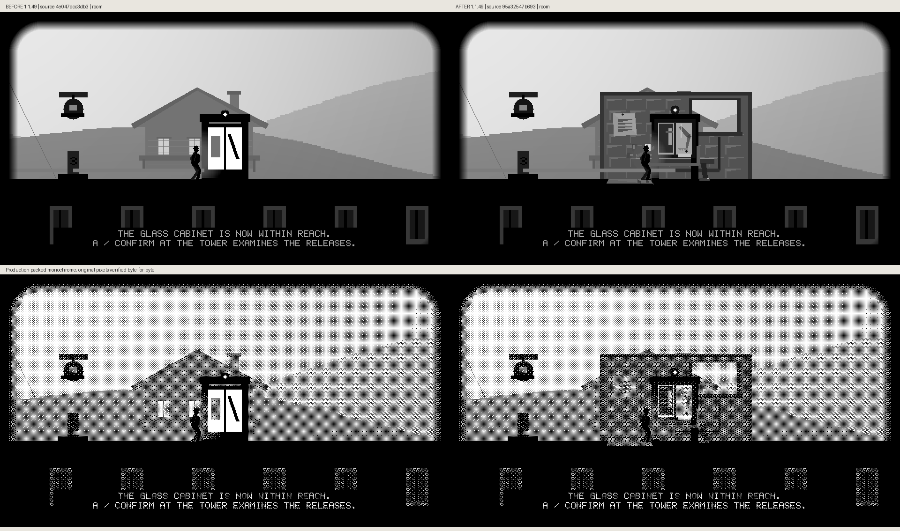
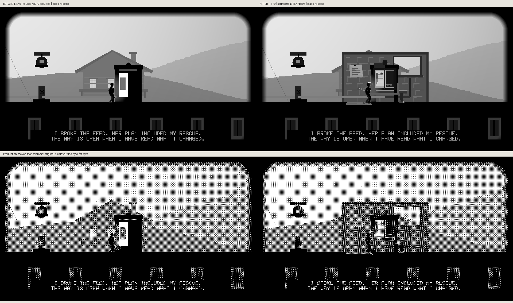
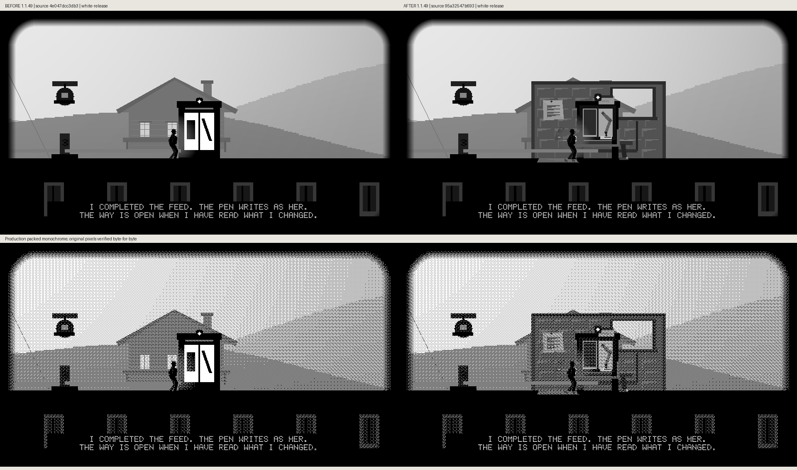

# Cabinet-room production comparisons

Actual production grayscale and packed-monochrome frames: local source `4e047dcc` → `95a32547`, both unreleased 1.1.49. The real route and submitted choice pages earn each release. The tested source is published in PR414; these are its actual captured comparisons.

## Room

## Black Release

## White Release

## Writing

