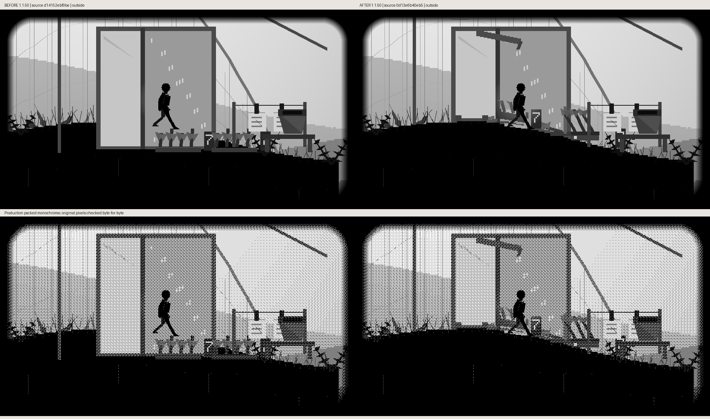
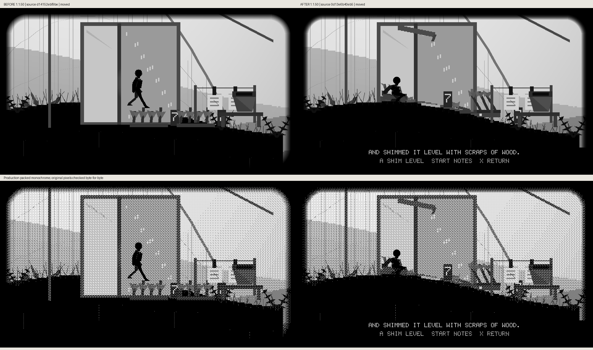
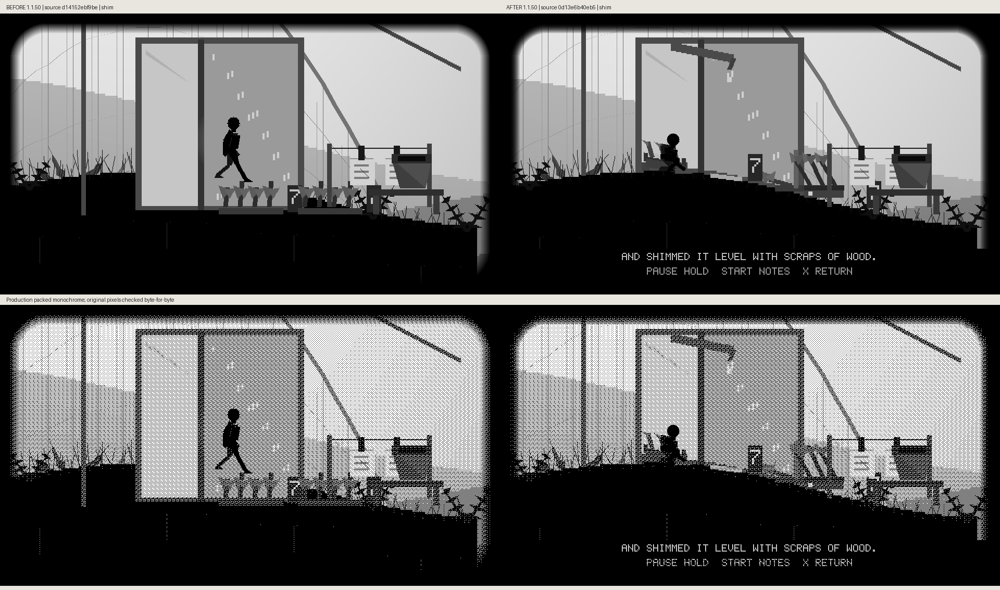
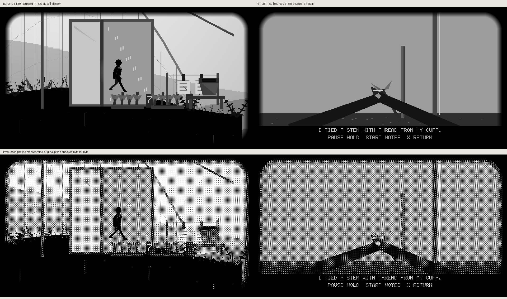
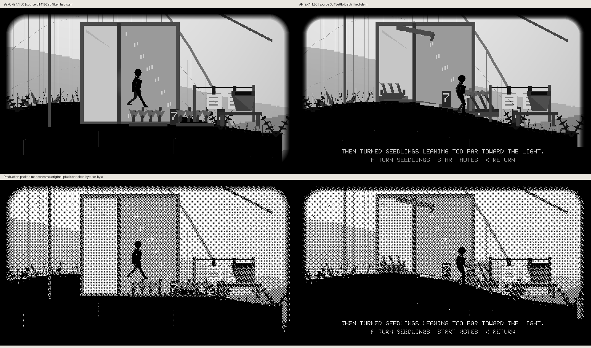
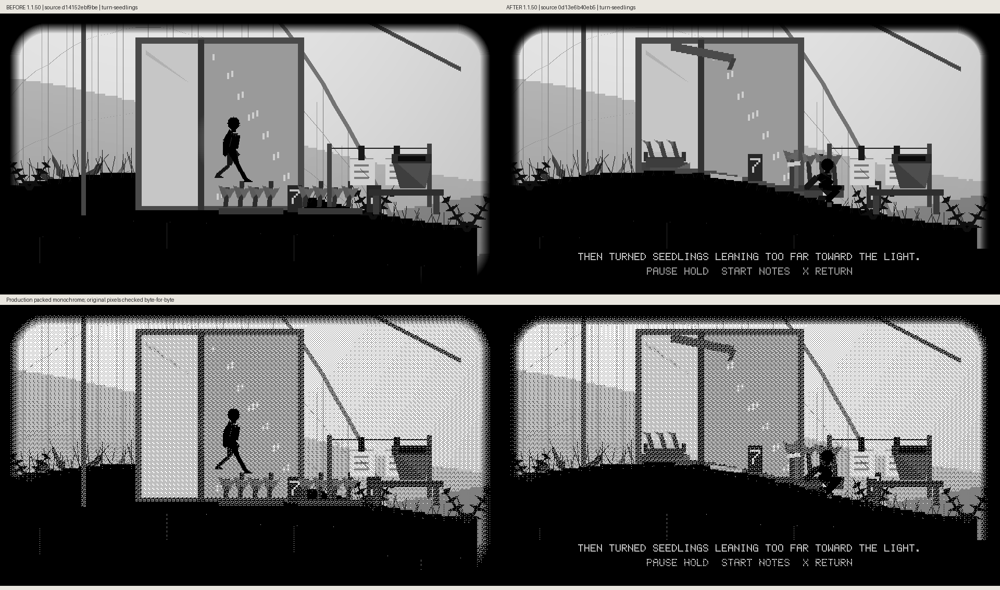
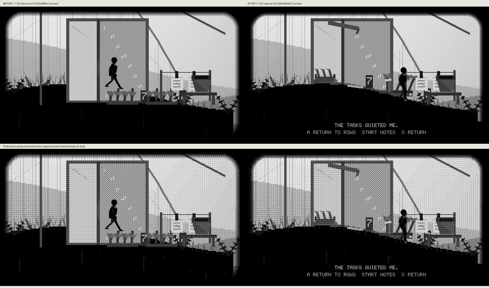

# Evening care beside the count wire

Fourteen actual before/after comparisons were captured. Twelve are available
here; the tying and wet-tray image uploads remain blocked and are preserved
in the complete delivery archive. Each comparison retains unscaled 960×540
production grayscale and packed-monochrome panels. Before app source is
`d14152ebf9be75f7d3fe04802efbfbd5d2e25a50`; after app source is
`0d13e6b40eb585424d1bf7722b433689021a0434`. Both use cumulative unreleased1.1.50.
The baseline stays in ordinary play at the same real route position. Captions,
source-file hashes and panel checks are retained in the metadata here.

The new optional sequence moves the wet tray out of the fixed drip, levels it
with wood scraps, ties the fallen stem using cuff thread and turns the leaning
seedlings. A shared close view makes the thread and knot visible in mono.
Finished props stay tended. Existing count sheets, route, puzzles and evidence
remain available independently.

Reproduce with `scripts/preview_hollow_trail_care.py --help` and the exact source
checkpoints. These are host-rendered game pixels, not device or FPS measurements.
See [implementation and validation](../../HOLLOW_TRAIL_CARE_1_1_50.md).

## Outside

## Wet tray

The source-labelled comparison is preserved in the delivery archive; its GitHub image upload remains pending.

## Pickup

## Carry

## Moved

## Shim

## Level

## Cuff thread

## Lift stem

## Tying

The source-labelled comparison is preserved in the delivery archive; its GitHub image upload remains pending.

## Tied stem

## Turn seedlings

## Turned

## Returned

