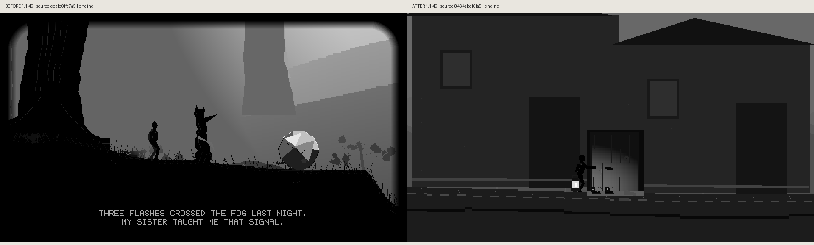
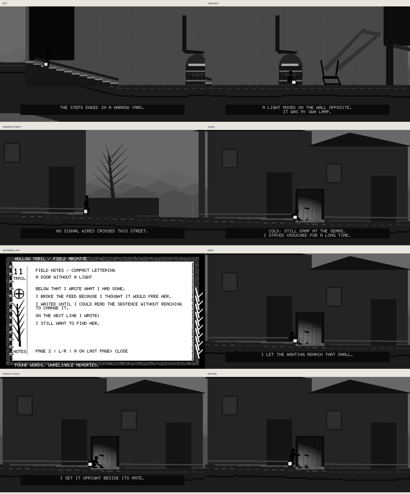

# Final door: real before/after captures






The left comparison is the tower exit at parent integration **eeafe0ffc7a5baf2c56e77d053d171f43a2b026e**,
which returned to the forest. The right is the final held Chapter XI frame
reached by the same fixture followed by production Right/A inputs and actual
notebook pagination. No Chapter XI picture existed in the baseline, so this is
an ending-behavior comparison rather than a claim of equivalent scene content.

The comparisons preserve the production 960×540 grayscale and packed mono
pixels. Labels are outside them; comparison crops are checked byte-for-byte.
Redundant individual captures are regenerated by the script rather than stored
alongside the same pixels in the comparisons/contact sheet.
The contact sheet is only a layout of real captures. The reader provider is
absent in this host fixture, so notebook PNGs show the actual compact fallback.
Both waiting images remain identical after 10,000 additional simulation ticks.

Source-file and raw image hashes are in before/capture-metadata.json,
after/capture-metadata.json and after/comparison-metadata.json. After hashes
identify the exact combined shutter/final-door source snapshot included in this
increment. No hardware FPS, panel response or ghosting is inferred.

Regenerate from a clean source snapshot of the baseline and the current tree:

```sh
mkdir -p /tmp/hollow-door-before-7a20
git archive eeafe0ffc7a5baf2c56e77d053d171f43a2b026e Apps lib/NativeApps/include sdk/driver | tar -x -C /tmp/hollow-door-before-7a20
python scripts/preview_hollow_trail_final_door.py --source-root /tmp/hollow-door-before-7a20 --output /tmp/door-before
python scripts/preview_hollow_trail_final_door.py --output /tmp/door-after --compare-before /tmp/door-before
```

Comparison captions identify both the app version and the verified source commit.
The shared 1.1.49 version is one unreleased update containing multiple source
checkpoints, not a claim that both pictures show identical code.
