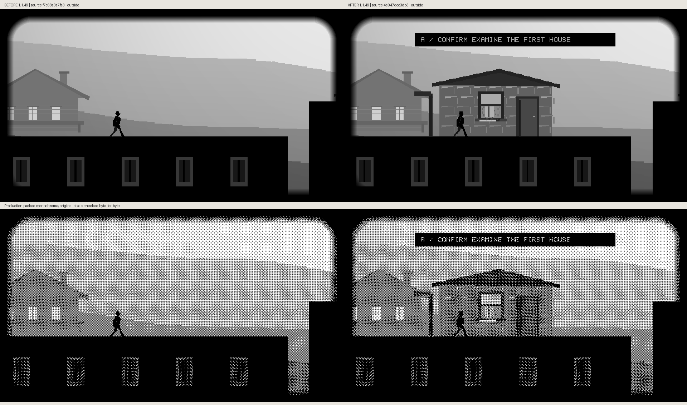
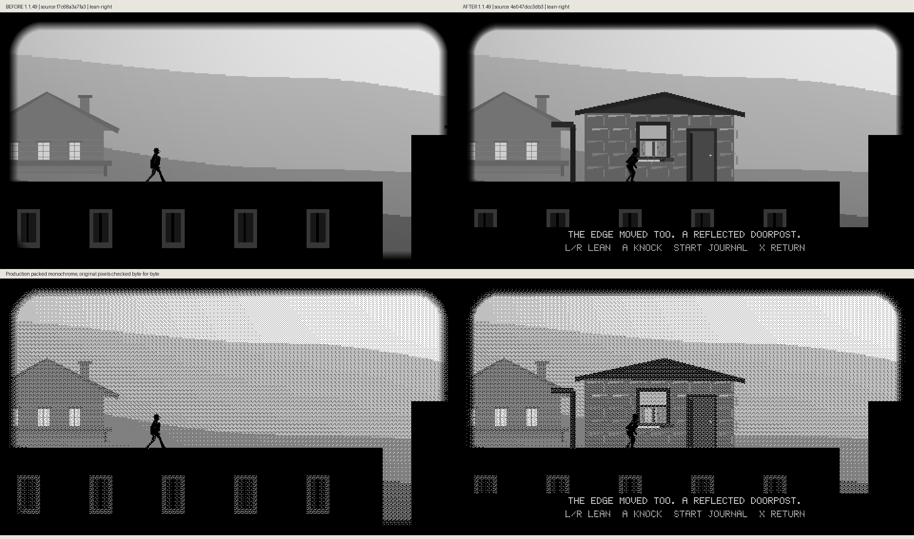
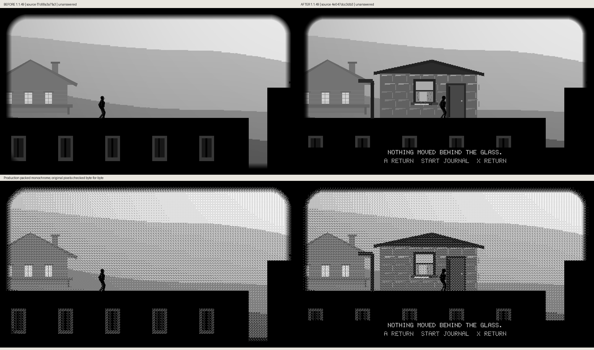

# First-house production comparisons

Baseline local source `f7c68a3a`; implemented local source `4e047dcc`. Both are unreleased 1.1.49 with corresponding source now published in PR414. Before Confirm has no action at this location. After, the existing route supports observation, leaning, door contact and an unanswered wait. Every grayscale/packed-monochrome raster region is preserved byte-for-byte.

## Outside

## Window

## Lean Left

## Lean Right

## Approach

## Knock

## Waiting

## Unanswered

