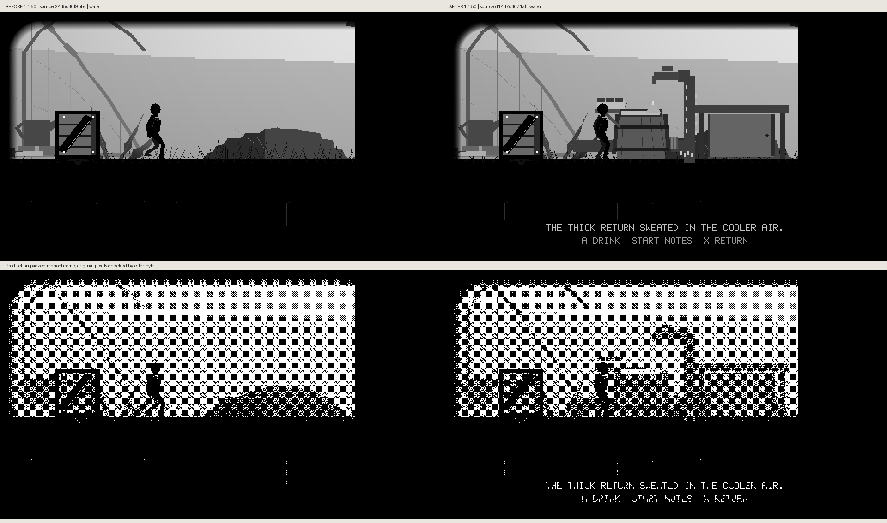
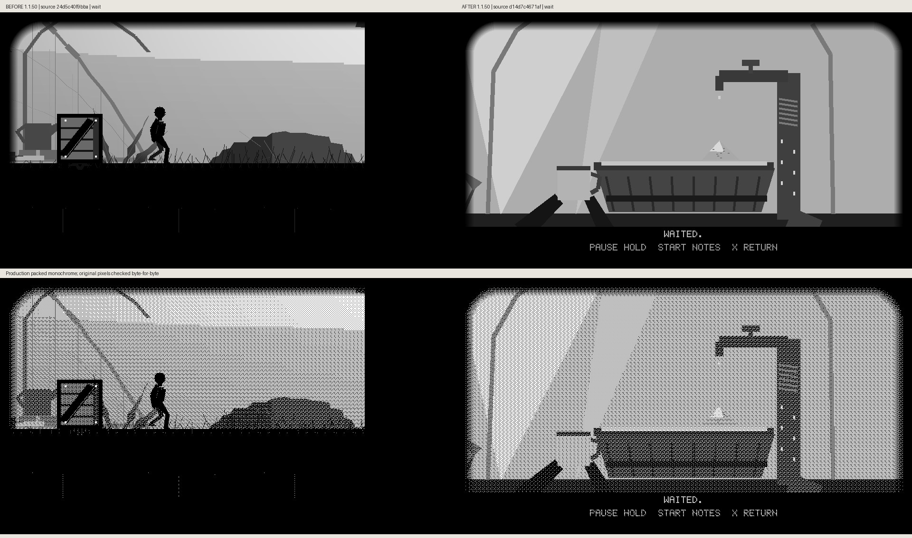
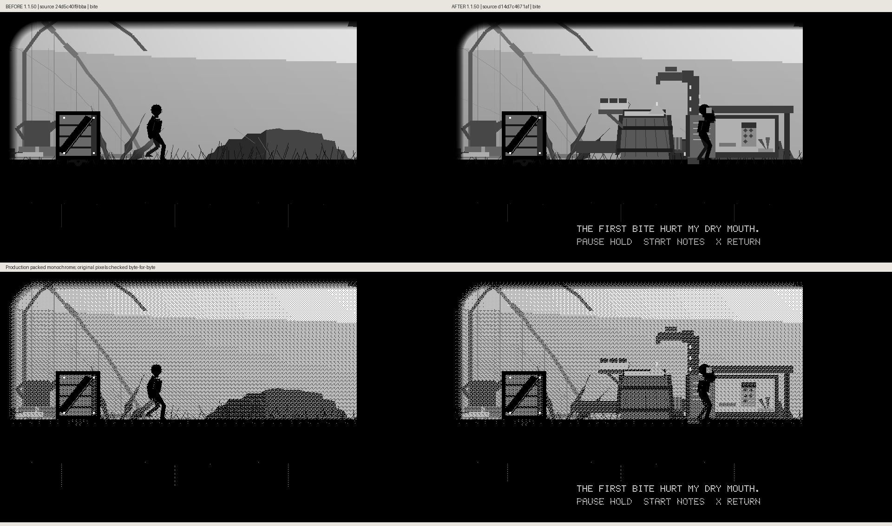
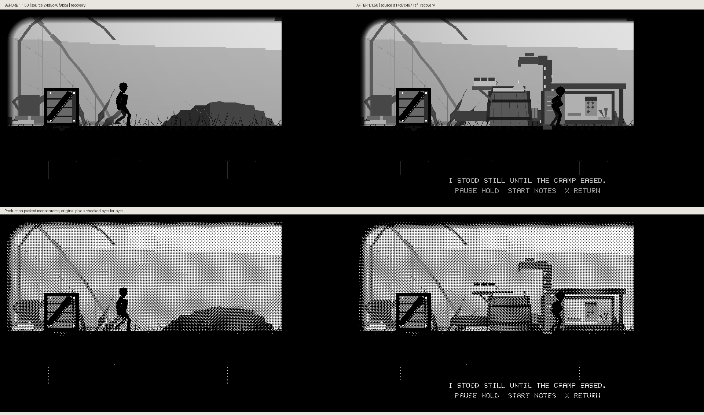
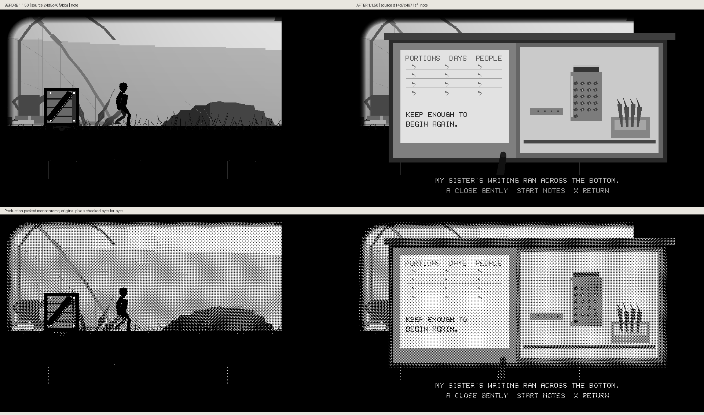

# First-house water and food: actual before/after frames

The real player walks from the level-6 spawn and jumps past the unchanged X330
crate to the first-house work area. A/Confirm earns filling a cup and drinking,
a deliberate wait, a second drink, cupboard opening, taking one biscuit,
eating/recovery, the inner-door list and gentle closure. The near-ground return
sweats; one slow tap drop falls toward its mineral mound. The note reads
“Keep enough to begin again.” No evidence collectible or required gate is added.

Before source `24d5c40f9bba1211f64a14d51937cfcd113c9cce` remains in ordinary
play at the same spot; after app source `d14d7c4671af331704c50701f7c38dbd804a1320`
earns all scene stages through normal mapped input. Both are cumulative 1.1.50.
The after source also removes the taken biscuit from its reachable shelf.

Each comparison retains unscaled 960×540 grayscale and actual production-packed
monochrome. The script verifies each panel byte-for-byte against its original
frame. [Metadata](comparison-metadata.json) records all source hashes, actual
input-earned states and changed-pixel counts. Reproduce with
`scripts/preview_hollow_trail_food.py`. Host pixels do not establish hardware
appearance, ghosting or FPS.

## Outside

## Water

## Drink

## Wait

## Slow Tap

## Drink Again

## Food

## Biscuit

## Bite

## Recovery

## Note

## Closing

## Returned

