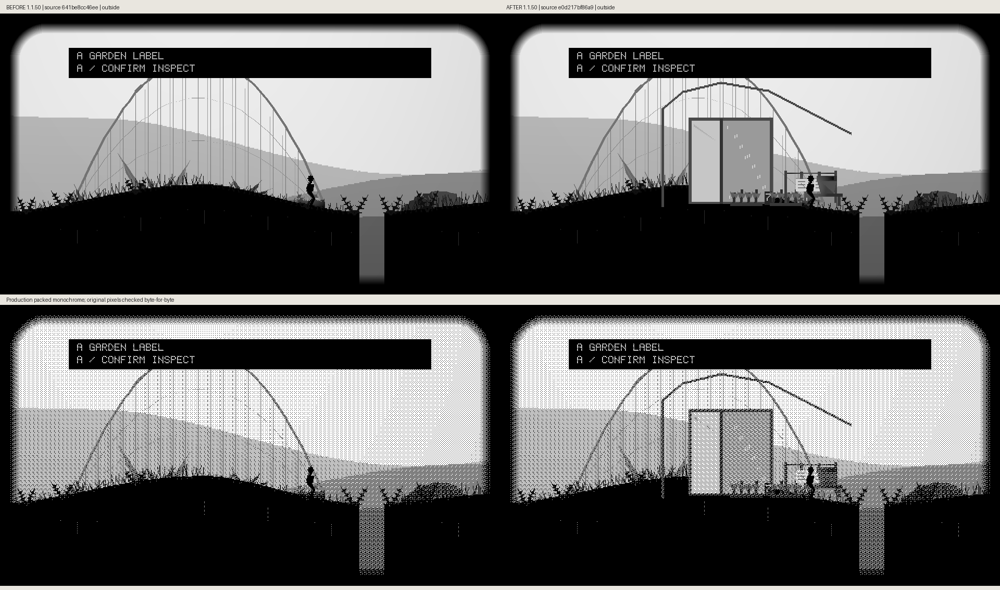
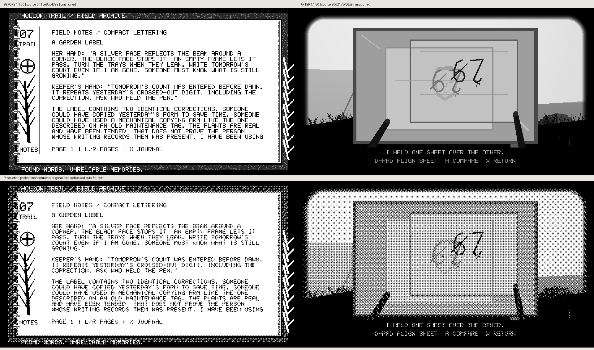
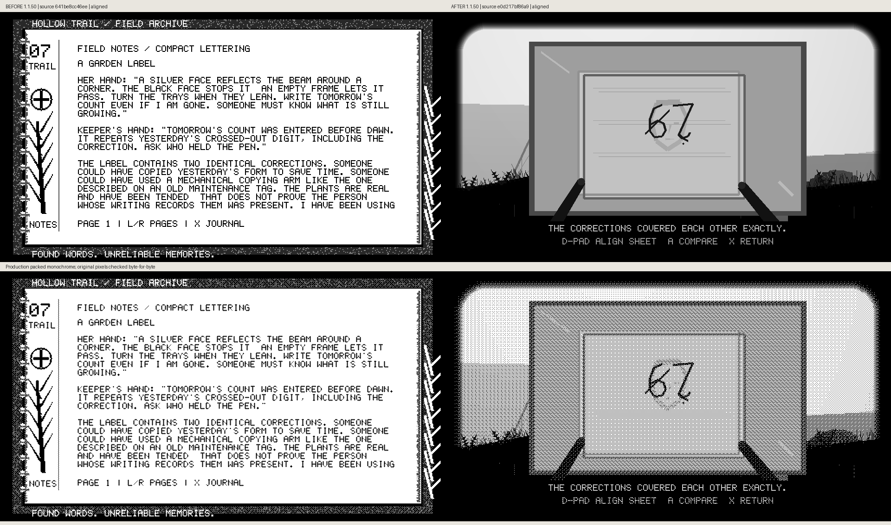
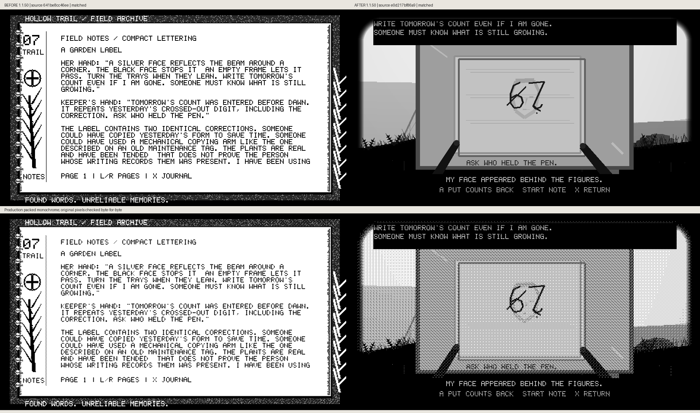
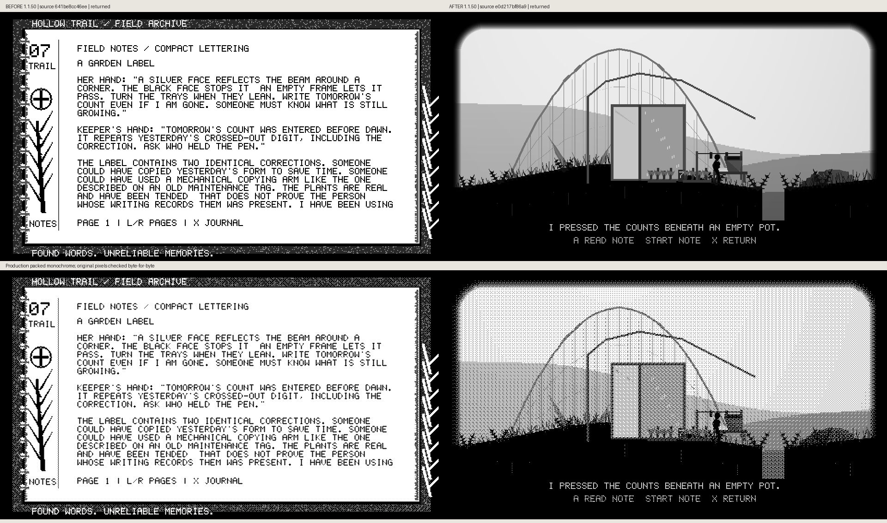

# Garden counts: actual before/after frames

The actual level-6 route reaches the existing garden-label evidence page19. Before source `641be8cc46ee8a95bceac5faab20405c5cd7c544` opens its journal. After source `e0d217bf86a92cd9d842c46374a2a64c802666a9` opens the physical wire-to-pane scene using normal app input. Both are cumulative unreleased 1.1.50 builds. Source labels distinguish the actual compared commits.

The player picks up both clipped sheets, carries them to the last clear pane, aligns the copied correction on two axes and returns the papers beneath an empty pot. Shared correction geometry preserves the fork, dot and unjoined gap. The weak reflected face remains behind the figures. The original evidence, route, mirror solution and read/ending guards are retained.

Each comparison preserves unscaled 960×540 grayscale and production packed-monochrome frames, verified byte-for-byte. These are host renderer captures, not panel/FPS/ghosting measurements. Reproduce with `scripts/preview_hollow_trail_counts.py`; [comparison metadata](comparison-metadata.json) retains source hashes, real input fixture and observed states.

## Outside

## Wire

## Pickup

## Carry

## Unaligned

## Aligned

## Matched

## Returning

## Returned

