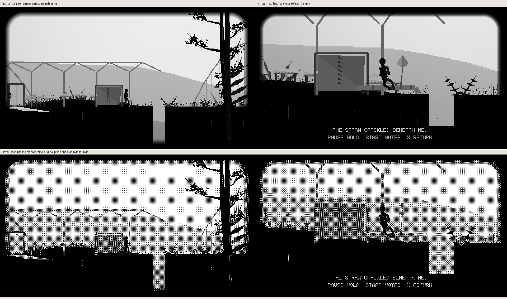
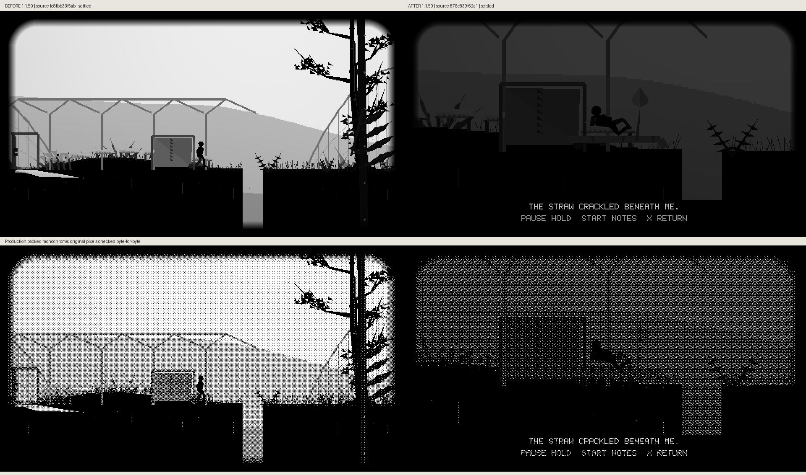
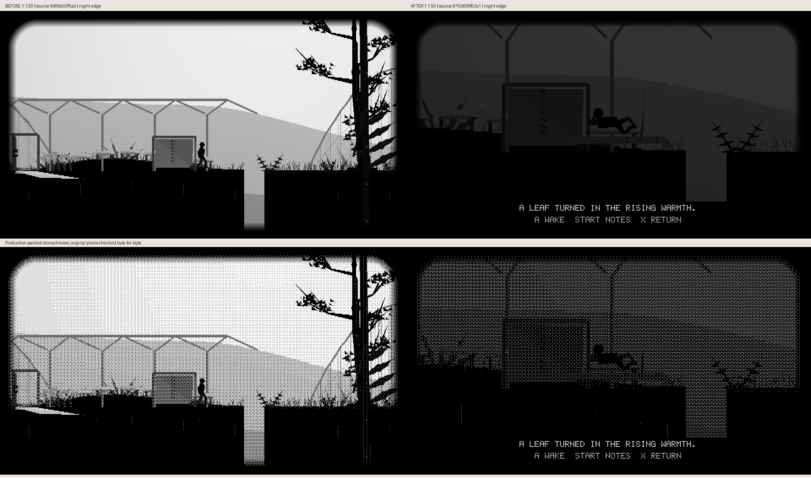
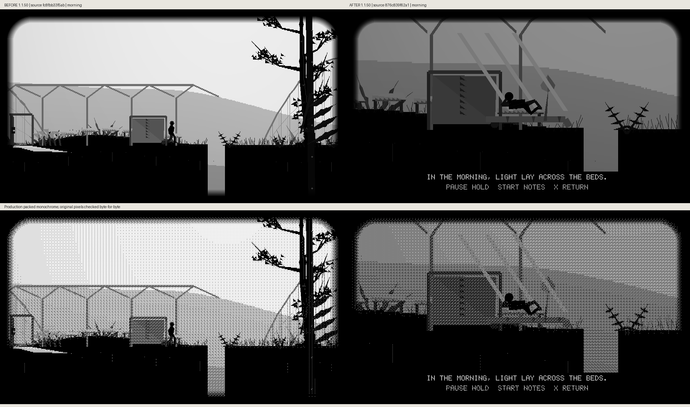
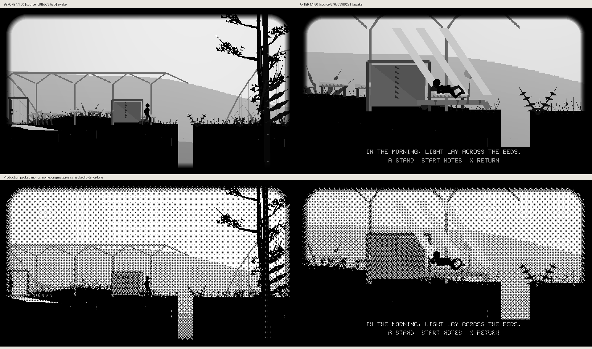
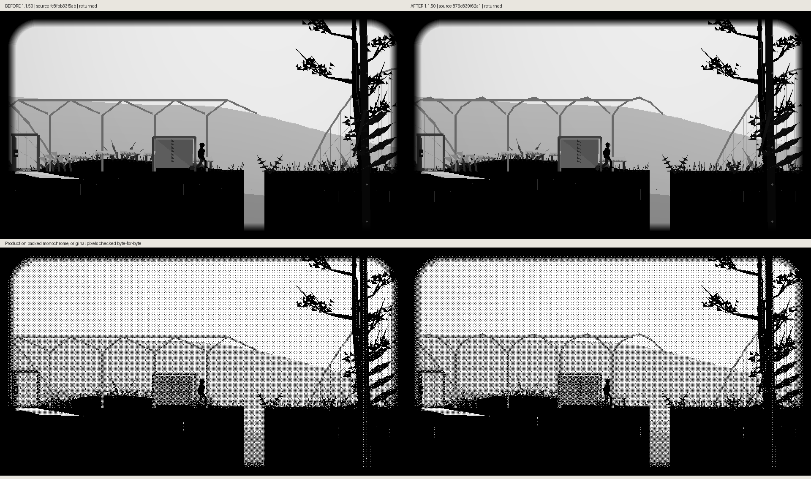

# Chosen glasshouse night: actual before/after frames

The player follows the actual glasshouse route to the farthest existing pallet and may choose to rest. The close room shares its real bed/soil coordinates and caption-safe camera with the lying body. A nearby leaf rotates around its fixed vein; the pipe has a tiny irregular surface cue. Morning light enters in pale bars, then the player stands. The original route, crate, mirror state and evidence are restored exactly.

Before source `fc8fbb33f5aba199391d8ce6c999ef863471573d` stays in ordinary play at that point; after source `876c839f62a1aaed2ea7e801f532e460b59834d9` uses real app input to earn each stage. Both are cumulative unreleased 1.1.50. Captions retain the actual compared revisions.

Each pair preserves unscaled 960×540 grayscale and packed monochrome, checked byte-for-byte. [Metadata](comparison-metadata.json) records source hashes, observed state and the real-input fixture. Reproduce with `scripts/preview_hollow_trail_garden_night.py`. Host renderer evidence does not measure panel appearance, ghosting or FPS.

## Outside

## Chosen

## Sitting

## Settled

## Night Wide

## Night Edge

## Morning

## Awake

## Returned

