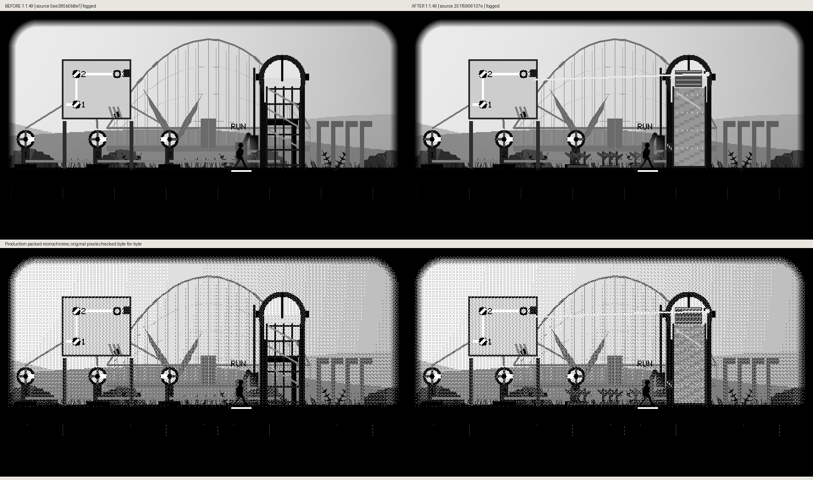
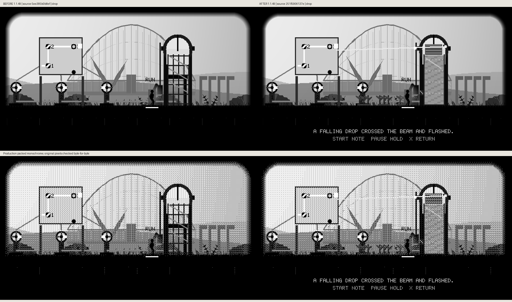
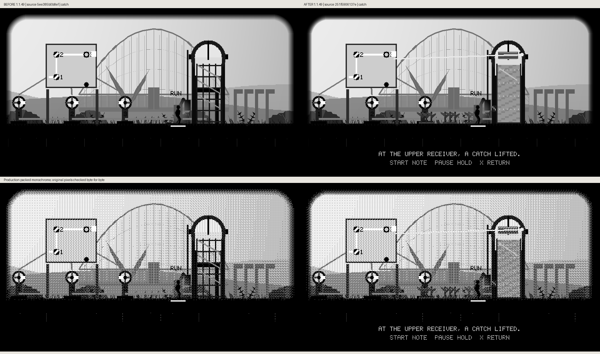
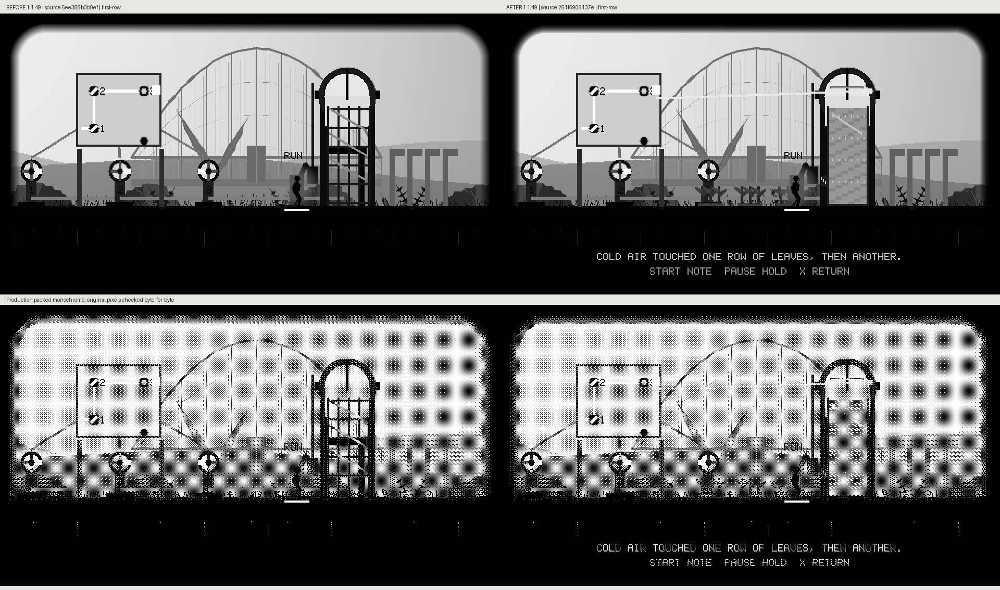
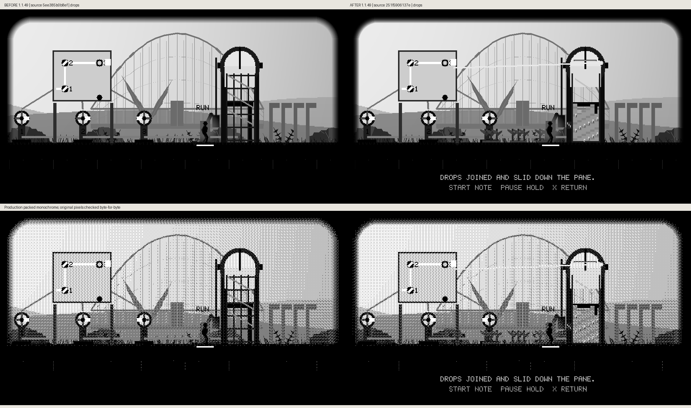
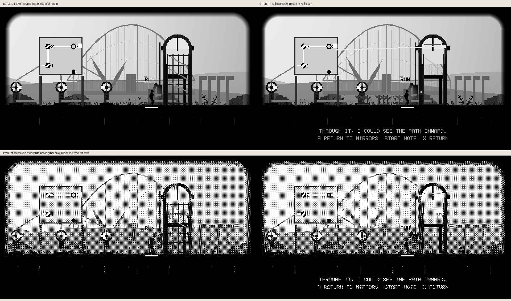
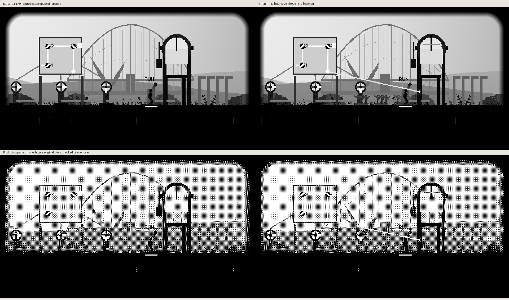

# Glass-partition production comparisons

Actual grayscale and packed-monochrome frames compare local source `5ee385b0` → `251f5906`, both unreleased 1.1.49. Real mirror controls earn the upper vent and subsequently open the lower latch. Every raster region is preserved byte-for-byte. The tested source is published in PR414; these files preserve its captured visual evidence.

## Fogged

## Drop

## Catch

## First Row

## Next Row

## Drops

## Clear

## Opened

