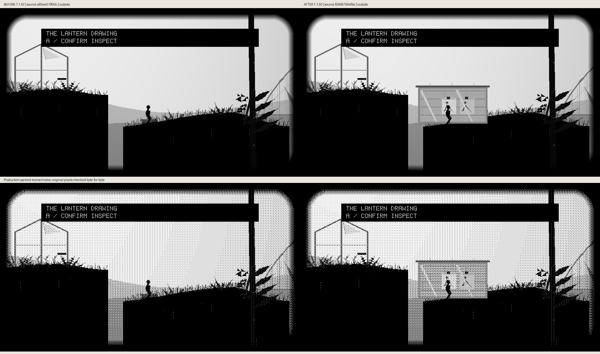
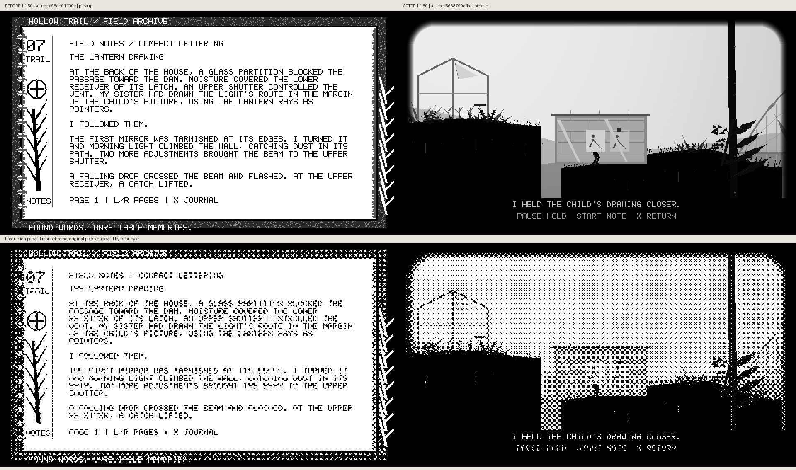
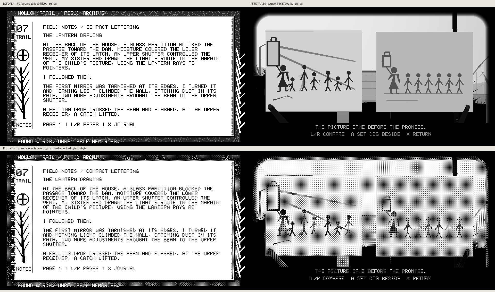
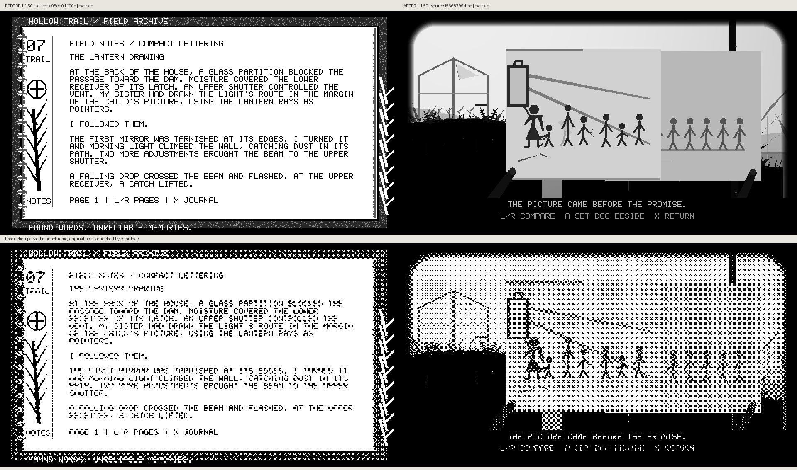
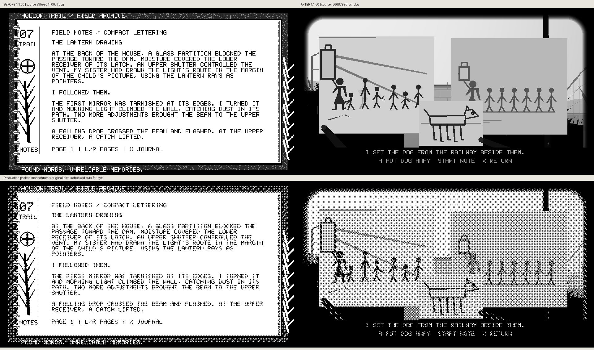
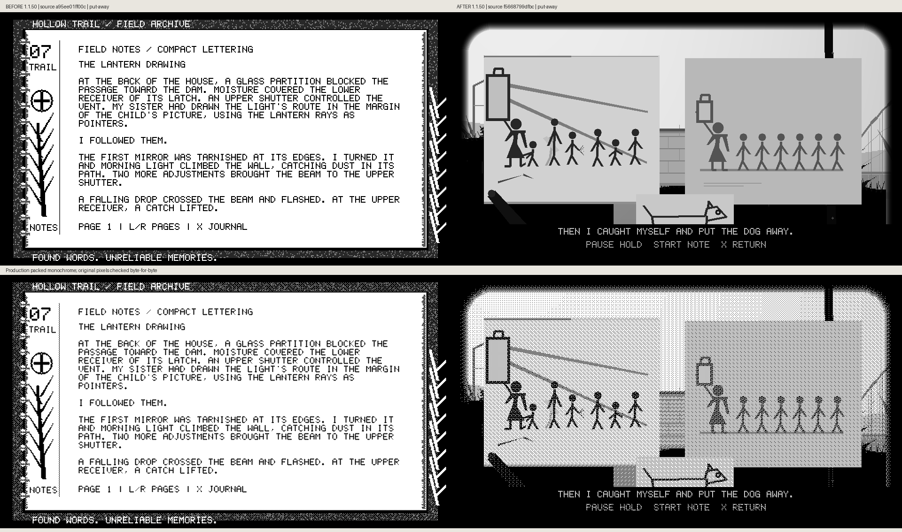

# Glasshouse drawings: actual before/after frames

The existing page-20 evidence find now has the child’s drawing beside the older card on its actual support. Real app input lifts the drawing, moves it beside the older image, sets the five-legged railway dog beside them, puts it away without claiming identification, and returns the drawing. The original mirror instructions and read/ending guards are retained.

Before source `a95ee01ff00c6ee50492d677457f79b304383e75` opens the existing journal; after source `f5668799dfbcbbc619a9d687daea1507ef316d3e` opens the physical scene. Both are cumulative unreleased 1.1.50 builds. Source captions are the actual compared revisions.

Each pair retains full 960×540 grayscale and production packed-monochrome pixels, checked byte-for-byte. [Comparison metadata](comparison-metadata.json) records the source hashes, real input fixture and states. Reproduce with `scripts/preview_hollow_trail_drawings.py`. These are host-renderer captures, not panel/FPS/ghosting measurements.

## Outside

## Hanging

## Pickup

## Paired

## Overlap

## Dog

## Put Away

## Returning

## Returned

