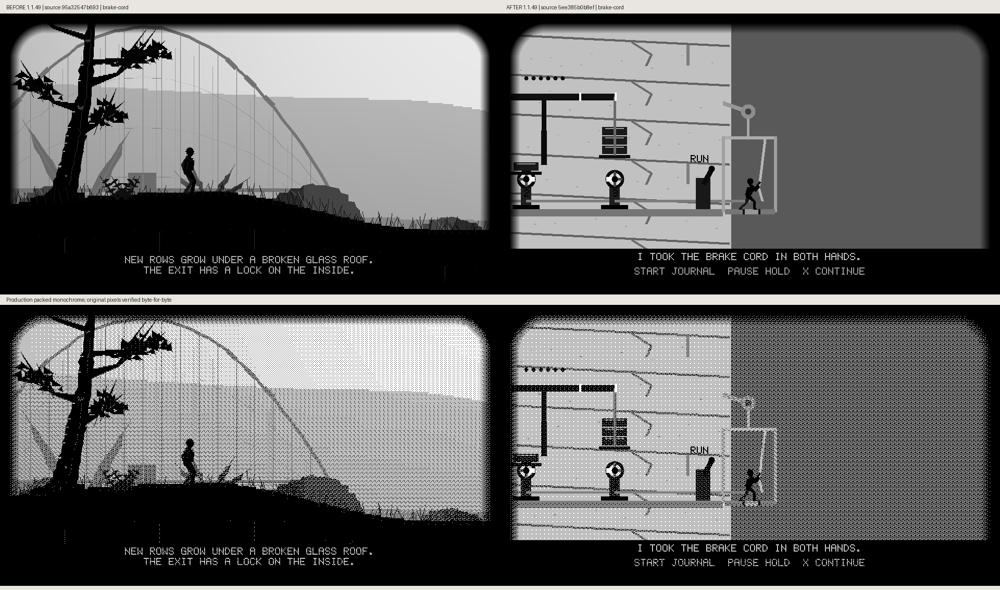
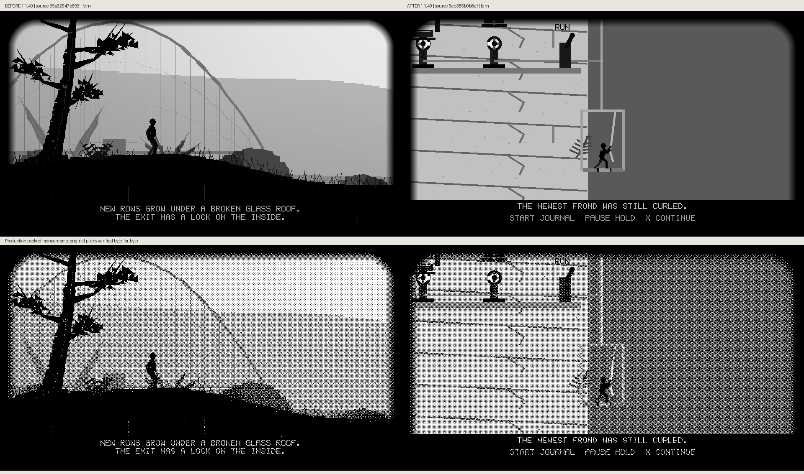
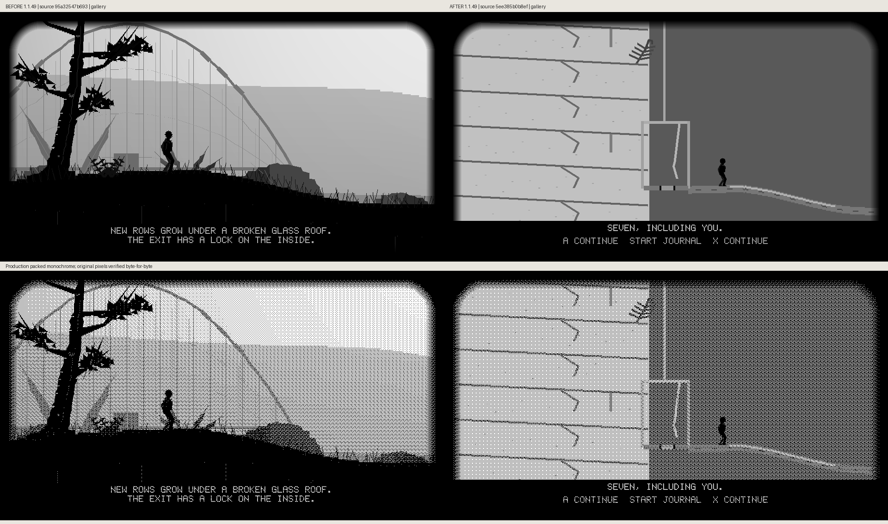

# Hoist production comparisons

Actual production frames compare local source `95a32547` → `5ee385b0`, both unreleased 1.1.49. Before, the solved quarry exit directly reveals the glasshouse spawn. After, that same transition earns the cage descent and lower-gallery walkout, holding the destination unchanged. Every grayscale and packed-monochrome raster region is preserved byte-for-byte. The tested source is published in PR414; these files preserve its captured visual evidence.

## Floorboards

## Brake Cord

## Fern

## Gallery

