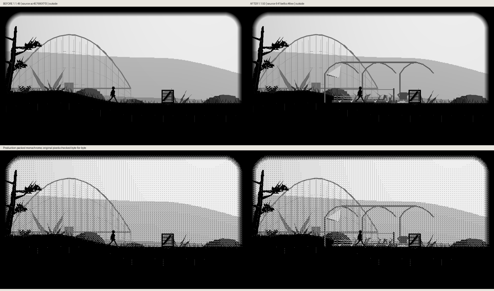
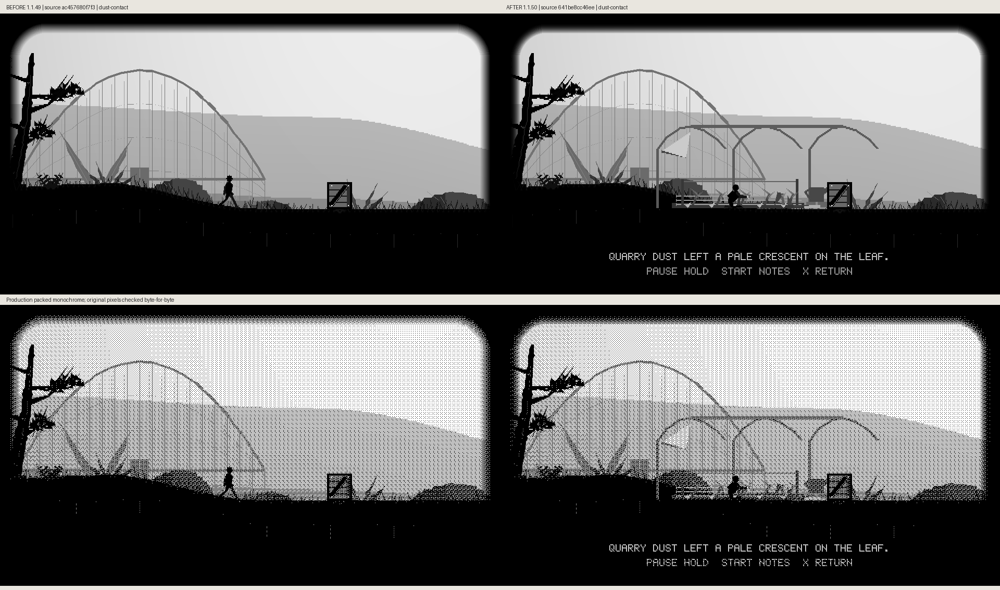
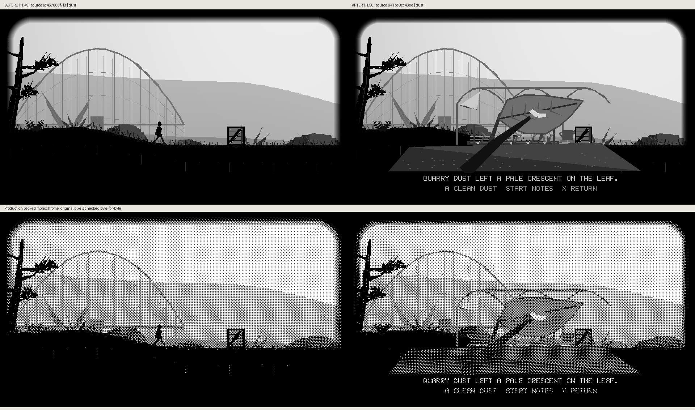
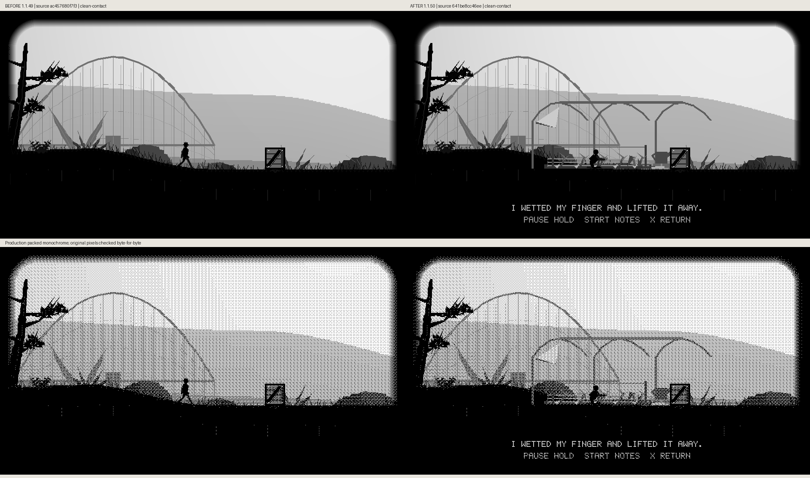
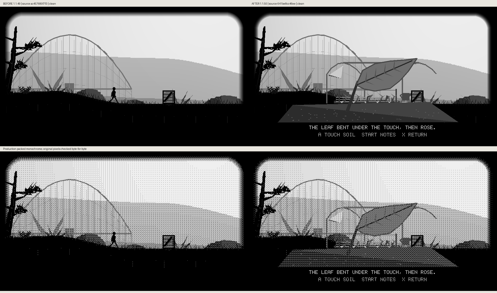
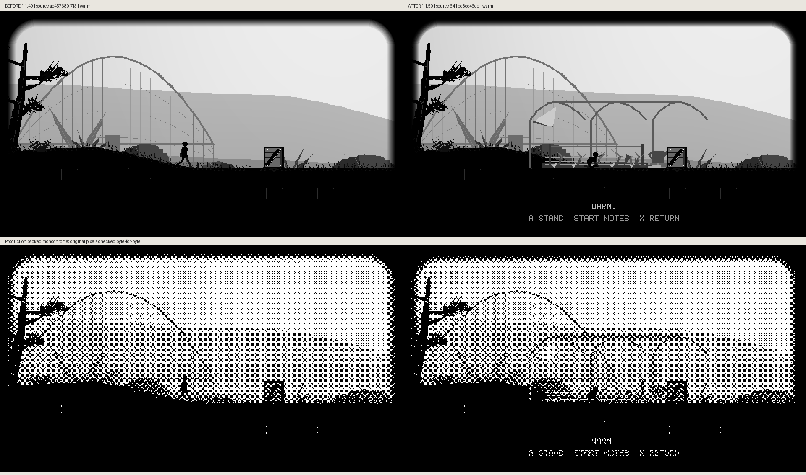

# Living bed: actual before/after frames

The player walks from the real glasshouse spawn to the first tended bed before the existing movable crate. Real app input earns kneeling, leaf contact, dust cleaning, released leaf and warm-soil contact.

Before: local source `ac457680f73`, unreleased 1.1.49, whose app source matches the merged signal-cabin baseline. After: local source `641be8cc46ee`, 1.1.50, reconciled onto merged master `c765a9931e2f1772d1dd3b5870362c18a08a9e57`. Captions describe the actual source builds.

Each comparison retains unscaled 960×540 grayscale and production packed-monochrome pixels, checked byte-for-byte by `scripts/preview_hollow_trail_bed.py`. These are host renderer captures, not panel/FPS/ghosting measurements.

## Outside

## Kneeling

## Dust Contact

## Dust

## Clean Contact

## Clean

## Soil

## Warm

## Returned

The ninth, returned-state comparison is preserved in the full delivery archive.
Its GitHub image upload remains pending after a publication-tool denial; it is
not included in this tree. The other eight comparisons above are delivered.

The complete source hashes, fixture, observed input state and pixel-change counts are retained in [comparison metadata](comparison-metadata.json). Historical 1.1.49 captures remain preserved independently.
