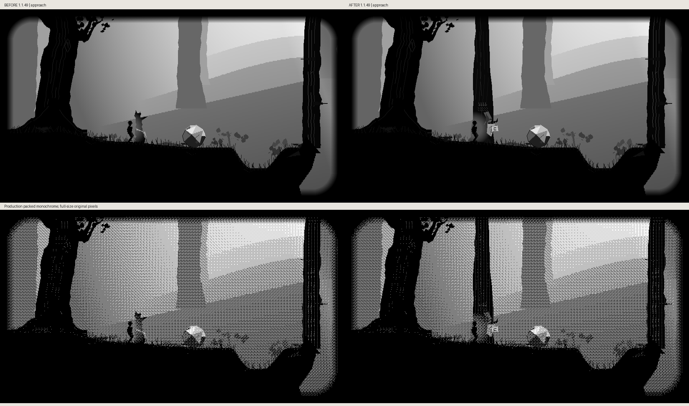

# Marked tree: production before/after




Baseline: public PR414 checkpoint `8464abdf6fa513c274ae3b65ef67c90603851474`.
Each comparison contains the original 960×540 grayscale pair above and production
packed monochrome below. All image regions are checked byte-for-byte. These are
real host game rasters, not generated illustrations or hardware photographs.

Both sources start at the real forest spawn and use production Right physics
steps to x120 for approach or x140 for inspection. Inspection invokes the actual
`ht_inspect` evidence action. The same fixed capture camera, weather and scale
are applied to both sides; game camera behavior is unchanged. The old snag is
replaced by the marked trunk at the same evidence location. Taking the paper
leaves the wool caught on its hook. The socket is a drawing on that paper, not
a physical lamp. The date has no invented numerals.

Source and raster hashes are in the before/after capture metadata, with changed
pixel counts in comparison metadata. Reproduce with Pillow and a C compiler:

```sh
python3 scripts/preview_hollow_trail_marked_tree.py --source-root /path/to/8464abdf --output /tmp/tree-before
python3 scripts/preview_hollow_trail_marked_tree.py --output /tmp/tree-after --compare-before /tmp/tree-before
```

No device FPS, panel ghosting or hardware qualification is claimed. The view
preserves full-size pixels; individual gray/mono PNGs can be regenerated.
