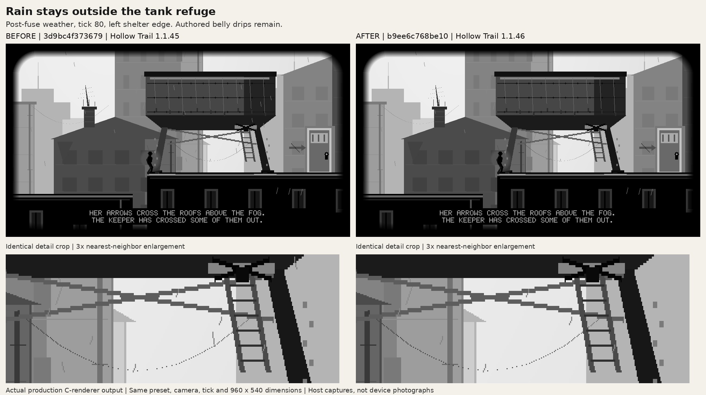
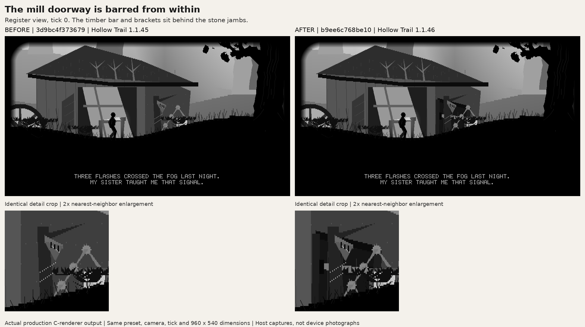
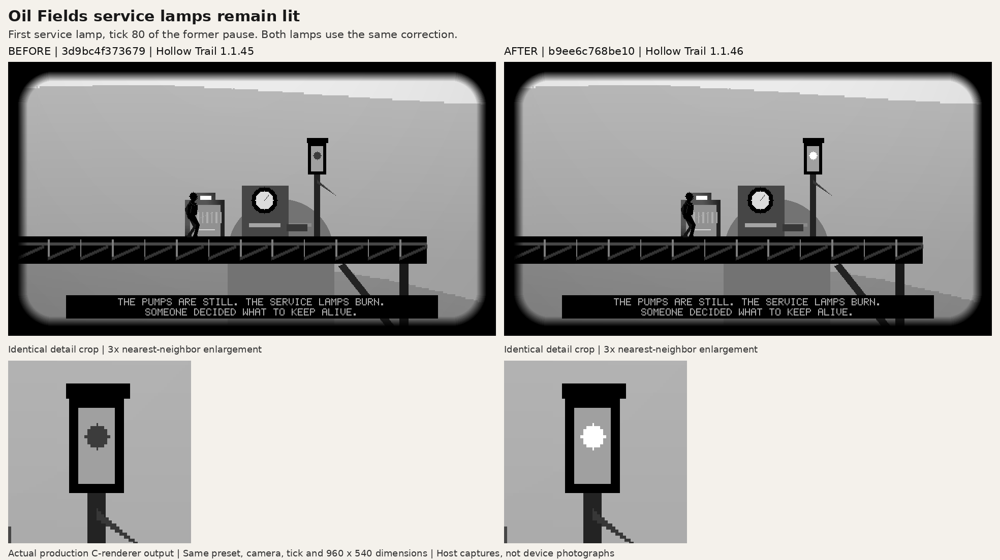

# Hollow Trail: actual before/after scene captures

These are actual host captures of Hollow Trail's committed production C renderer. They are not generated illustrations or photographs of e-paper hardware. Every comparison places the original 960 × 540 framebuffer capture on the left and the corrected 960 × 540 capture on the right, without resizing either full frame. The extra detail row uses the same crop on both sides and nearest-neighbor enlargement. Labels are outside the rendered frame.

- **Before production source:** [`3d9bc4f373679f5ae8dd184db6a8d0afa5a40231`](https://github.com/michaelrolphone-cmyk/T5S3-Reader/commit/3d9bc4f373679f5ae8dd184db6a8d0afa5a40231), Hollow Trail 1.1.45.
- **After production source:** [`b9ee6c768be1010eecd5d8f5922f64853876c9be`](https://github.com/michaelrolphone-cmyk/T5S3-Reader/commit/b9ee6c768be1010eecd5d8f5922f64853876c9be), Hollow Trail 1.1.46.
- **Shared capture harness:** [`scripts/preview_hollow_trail_story.py` at the after source](https://github.com/michaelrolphone-cmyk/T5S3-Reader/blob/b9ee6c768be1010eecd5d8f5922f64853876c9be/scripts/preview_hollow_trail_story.py), Git blob `80ee4cabf56b0dc829cec8bcb487bc08937d5b39`. The same harness was used in both trees so camera, tick, game state, native raster size and mono packing are identical. Only this capture script was overlaid into the before snapshot; its production app source was unchanged.

## Tank refuge

`--rain-shelter`, `wet-left80`: tick 80 with post-fuse rain active, player at the left shelter edge. The corrected render removes stray ambient streaks beneath the tank while retaining authored belly drips and rain outside. This native grayscale frame differs in 110 pixels; the correction is deliberately small.



## Mill entry

`--mill-entry`, `mill-register0`: tick 0 at the register view. The formerly plain wall now has the timber bar and brackets behind its stone jambs. The broken shutter and register remain in place. The native grayscale frame differs in 6,452 pixels, confined to the doorway.



## Oil Fields service lamps

`--service-lamps`, `service-near80`: tick 80, during the former signal pause. The service lamp remains lit. The native grayscale frame differs in 178 pixels inside the lens. Both service lamps were also captured at tick 0: already-lit grayscale and mono frames are byte-identical before and after.



## Reproduction

In separate checkouts of the before and after source commits, place the exact shared capture script above at `scripts/preview_hollow_trail_story.py` and run:

```sh
python3 scripts/preview_hollow_trail_story.py --rain-shelter --output dist/rain-shelter
python3 scripts/preview_hollow_trail_story.py --mill-entry --output dist/mill-entry
python3 scripts/preview_hollow_trail_story.py --service-lamps --output dist/service-lamps
```

Dependencies: host C compiler and Pillow. These captures used GCC 14.2.0 and Pillow 12.3.0. Each command uses the production scene and cutscene functions and writes native grayscale and packed-mono PNGs. All 21 grayscale pairs and 21 packed-mono pairs were reproduced. The representative full-frame pixels in these three comparison images were verified against their original captures, and the comparison images were visually inspected.

[`capture-metadata.json`](capture-metadata.json) records all 42 frame-pair hashes, changed-pixel counts, difference bounding boxes, source commits and exact crop coordinates. File hashes refer to individual native PNGs produced by the capture script, not these labeled comparison sheets. PNG file hashes can vary with Pillow/encoder versions even when decoded pixels match.

The current `hollow_trail_cutscene_test.c` was compiled and run against the after source and passed. This documentation-only capture commit does not alter app source, game behavior or the existing 1.1.46 version. It makes no hardware performance, e-paper refresh or device-qualification claim.
