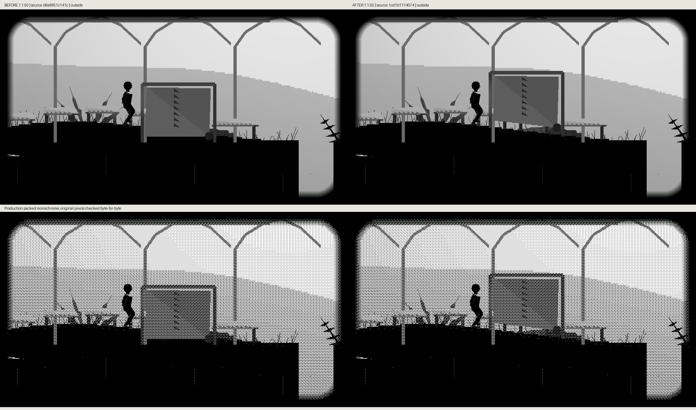
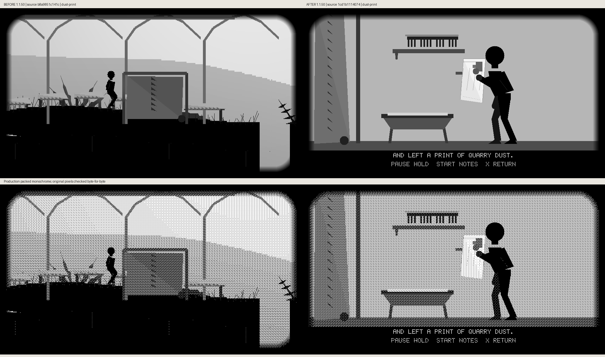
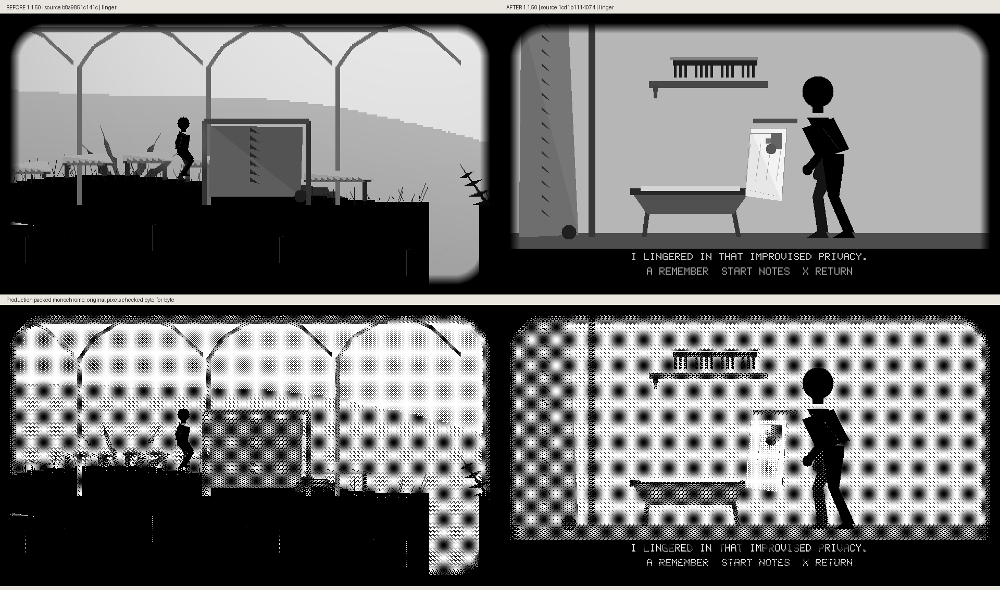
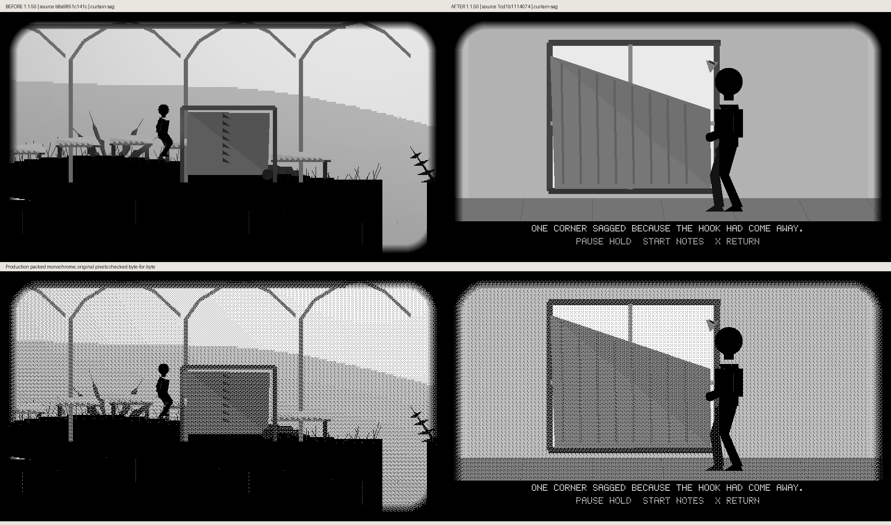
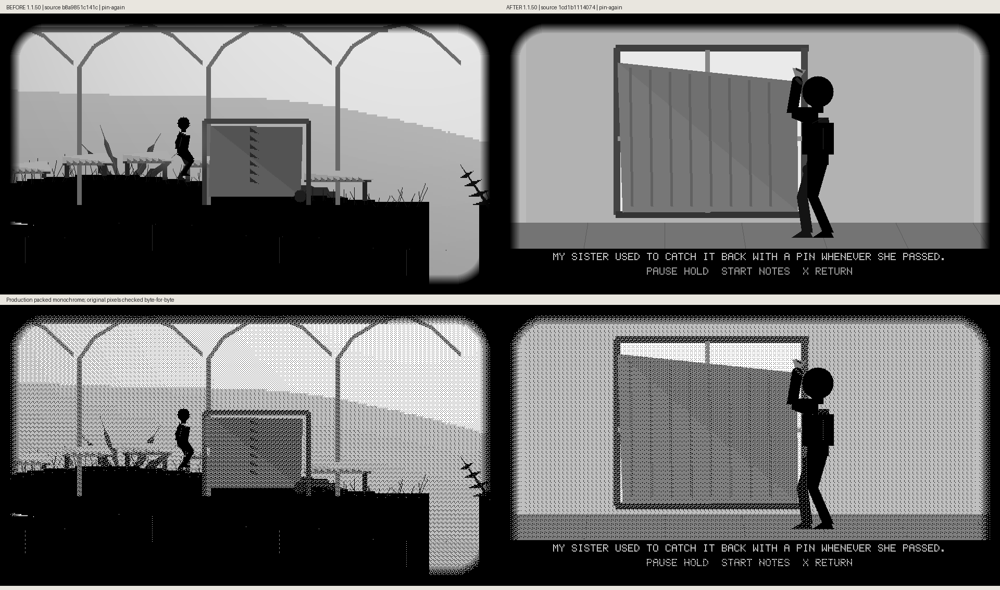
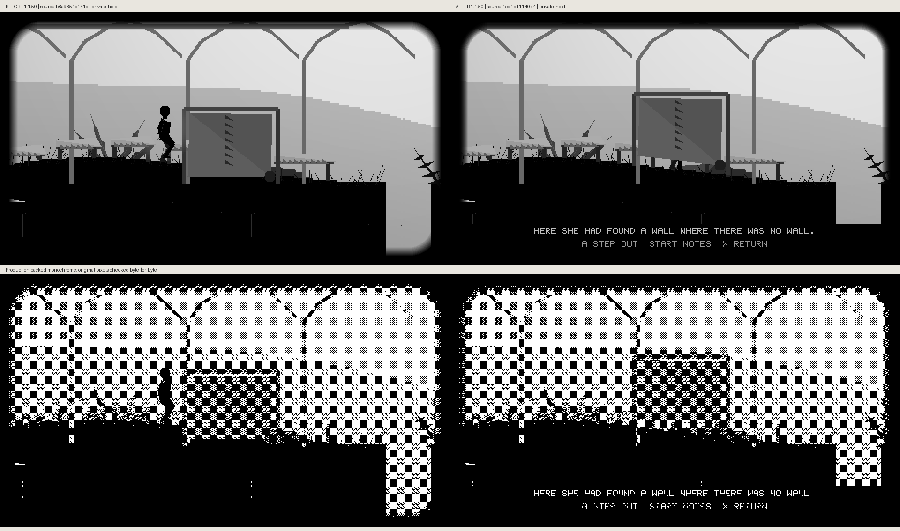

# Improvised privacy and the curtain-pin memory

Sixteen actual before/after comparisons were captured. Nine are included here;
the remaining full-size uploads are pending or blocked. Complete captures are
preserved in the delivery archive. Each comparison preserves unscaled 960×540
grayscale and production packed-monochrome panels. After app source is
`1cd1b1114074c180ade80f3b8a612bfeab3ec1a2`; before is the
source-labelled baseline recorded in the metadata. Both are cumulative unreleased
1.1.50. All source hashes and original panel pixels were verified.

See [implementation and validation](../../HOLLOW_TRAIL_PRIVACY_1_1_50.md). These are host-rendered
game pixels, not device appearance or FPS measurements.

## Outside

## Sacking

The source-labelled comparison is preserved in the delivery archive; its full-size GitHub upload remains pending.

## Step behind

The source-labelled comparison is preserved in the delivery archive; its full-size GitHub upload remains pending.

## Feet only

The source-labelled comparison is preserved in the delivery archive; its full-size GitHub upload remains pending.

## Basin comb

## Take fold

The source-labelled comparison is preserved in the delivery archive; its full-size GitHub upload remains pending.

## Cheek

## Dust print

## Lower towel

## Linger

## Curtain sag

## Pin curtain

The source-labelled comparison is preserved in the delivery archive; its full-size GitHub upload remains pending.

## Pin again

## Private hold

## Step out

The source-labelled comparison is preserved in the delivery archive; its full-size GitHub upload remains pending.

## Returned

The source-labelled comparison is preserved in the delivery archive; its full-size GitHub upload remains pending.

Runtime-source equivalents: the after snapshot matches the privacy source
checkpoint `2c1357004c6d89fb0183adddfaa60fcd677fdd9d`; the before snapshot matches
the care source checkpoint `27fb231a8b3d39243ad965c60f3244b79402004a`.
