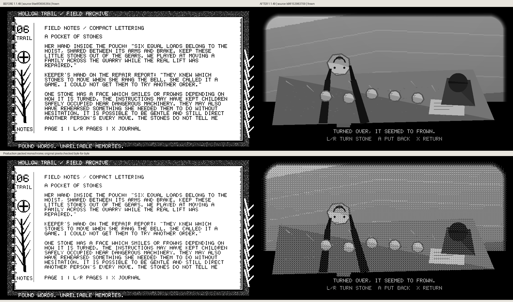
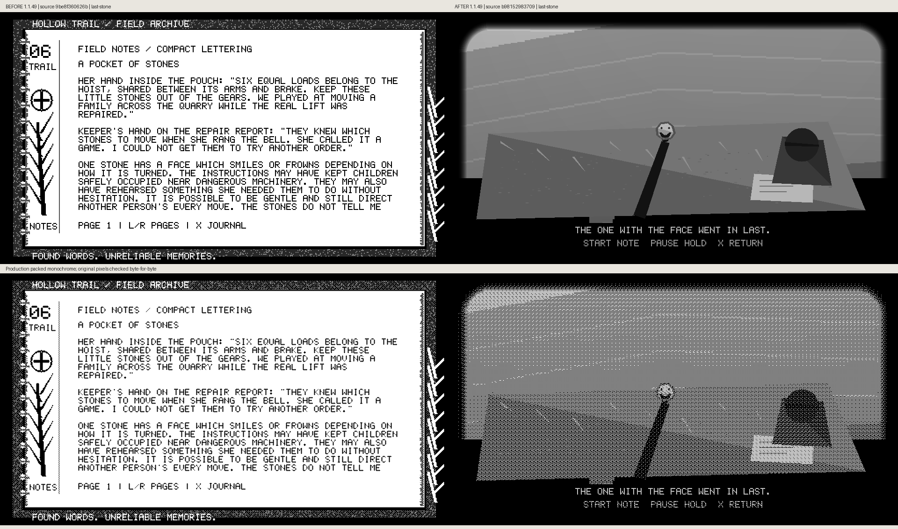
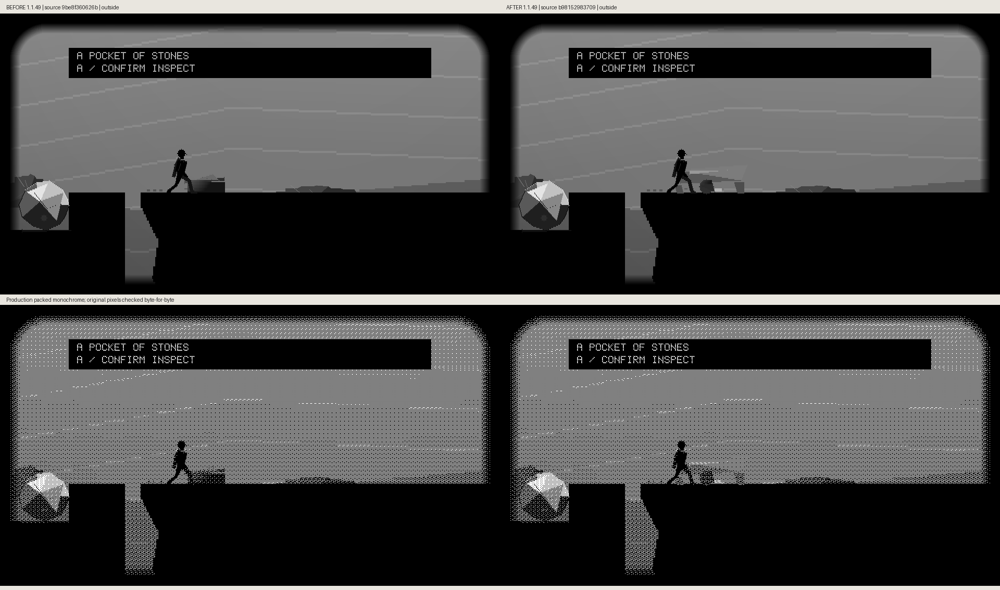
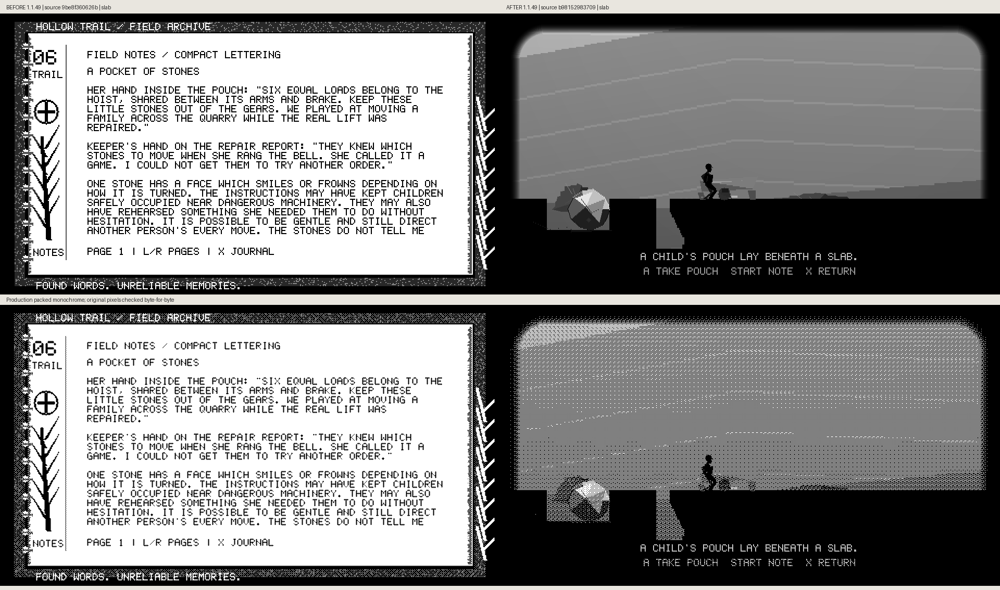

# Quarry pouch production comparisons

Recovered production renders compare source `9be8f360626b19971316a5ab85efc56a9fe3d889` → `b981529837092d22ea955a4465bdc0d60e482f0a`. The original capture labels and every raster region are retained. Descriptive fixture metadata was corrected without changing pixels.

## Frown

## Last Stone

## Outside

## Packed

## Placing

## Returning

## Slab

## Smile

