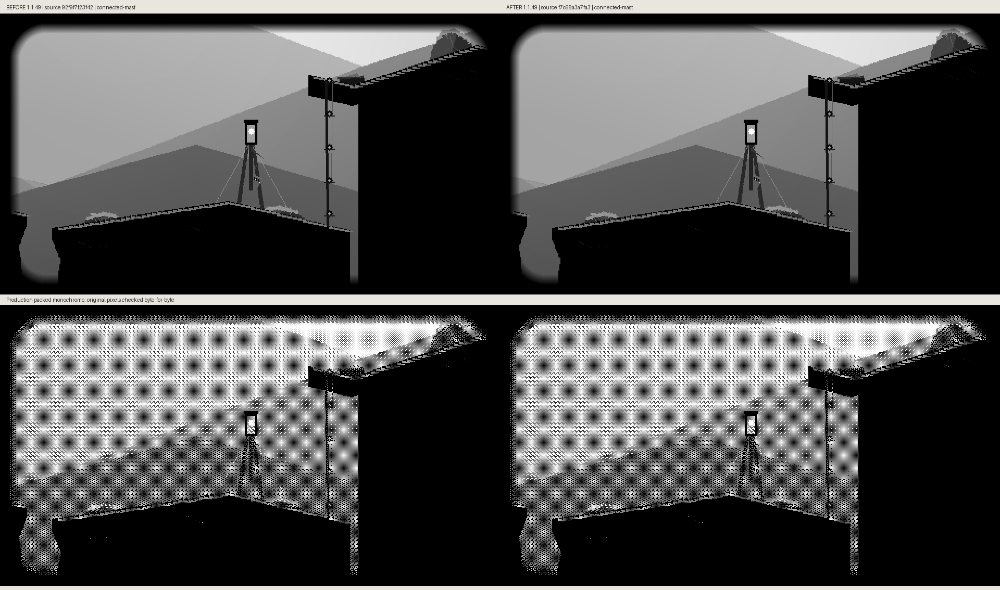
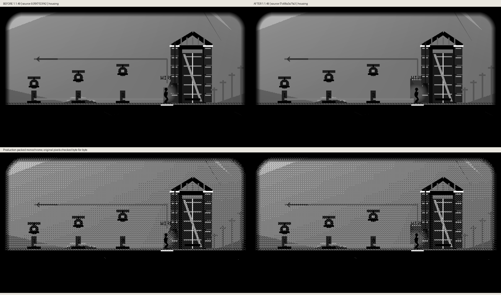
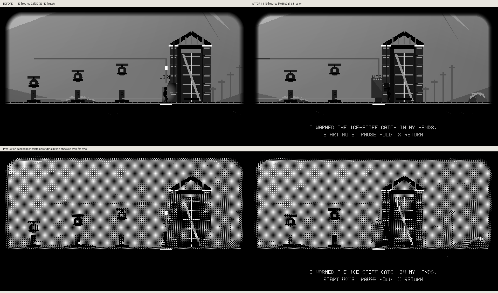
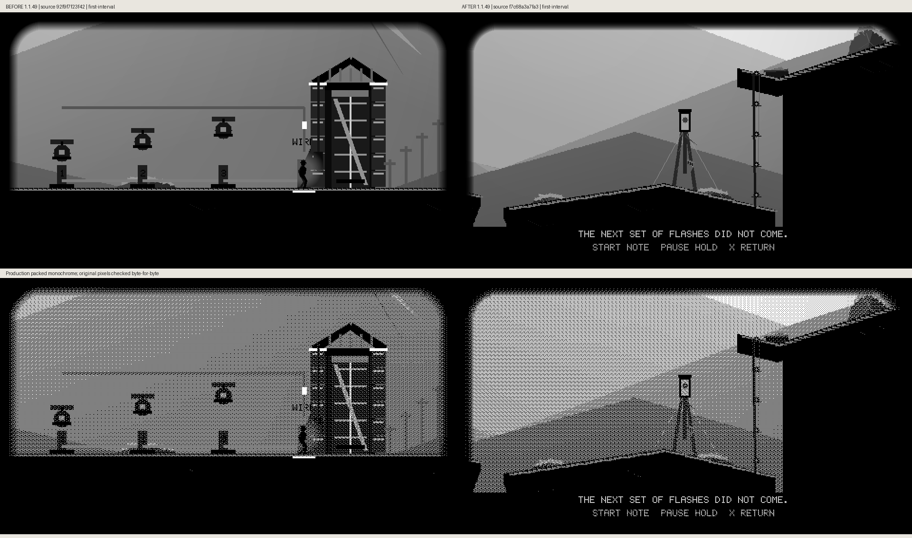
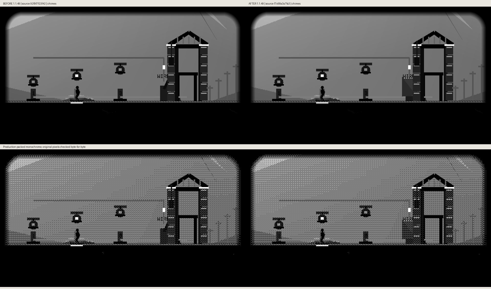

# Ridge isolator: production comparisons

Baseline local source `92f9f7f2`; implemented local source `f7c68a3a`. Both are unreleased 1.1.49 with corresponding source now published in PR414. The actual ridge route and existing WIRE control earn the scene. The mast shot uses the existing ridge landmark, with no invented tower. All grayscale/packed-monochrome pixels are preserved byte-for-byte.

## Connected Mast

## Housing

## Catch

## Open

## Knife

## First Interval

## Second Interval

## Gap

## Closed

## Chimes

