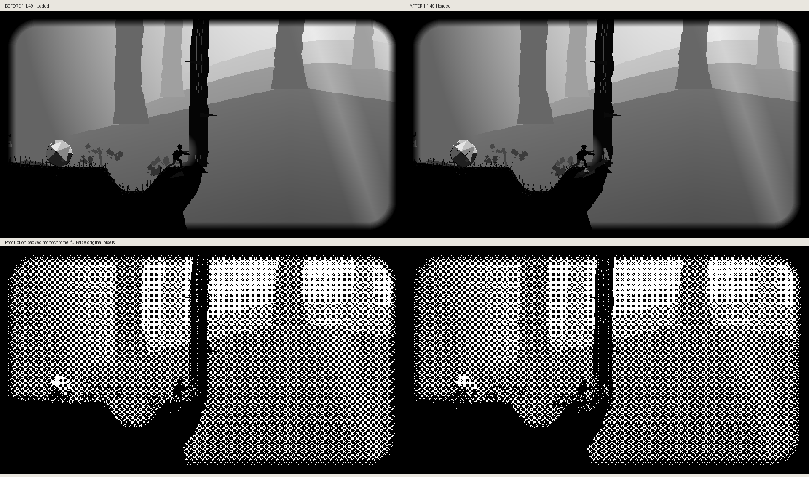
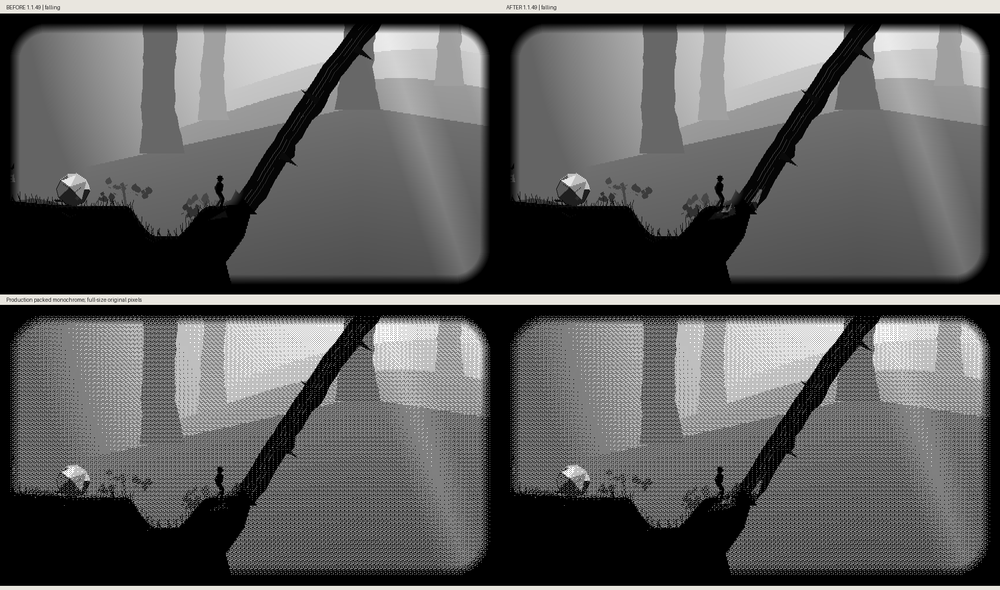
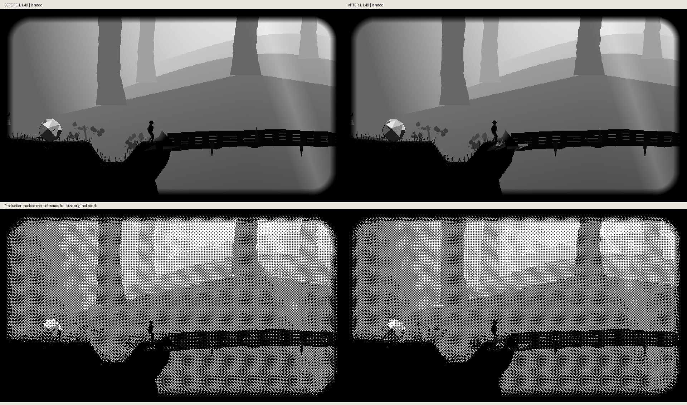

# Partly sawn roots: production before/after





The Chapter I book describes exposed, partly sawn roots holding the dead tree
against the bank. The existing root fan now shows a stopped kerf with tooth
tracks and an intact dark underside. Split wood follows the trunk's existing
rotation; the fixed stump shows the separated attachment once the fall begins.
These are material details on the existing support, not new props or footing.
Collision geometry, body/hand contacts, push strength, fall duration and camera
behavior are unchanged. No new particle system or automatic interaction exists.

Each comparison preserves full-size 960×540 grayscale above and production
monochrome below. Baseline is public `1e469466ae069dee59896b4f14ce58ce6acec8b6`.
The production physics fixture starts on the existing approach at x340/y220,
walks Right to the trunk and uses A contact. It holds Right until the actual
24-step loaded state or falling transition, then uses neutral physics to reach
phase12 or fully landed phase32. Assertions reject mislabeled states. Identical
camera/weather framing is applied to both sources for comparison, without
changing production camera behavior. See capture metadata for source hashes.

```sh
python3 scripts/preview_hollow_trail_sawn_roots.py --source-root /path/to/1e469466 --output /tmp/roots-before
python3 scripts/preview_hollow_trail_sawn_roots.py --output /tmp/roots-after --compare-before /tmp/roots-before
```

The script verifies comparison regions byte-for-byte and retains source/raster
hashes. Individual original PNGs are reproducible. These are game rasters, not
hardware photos; no panel, performance or hardware-qualification claim is made.
This remains the cumulative unreleased Hollow Trail 1.1.48 → 1.1.49 update.
