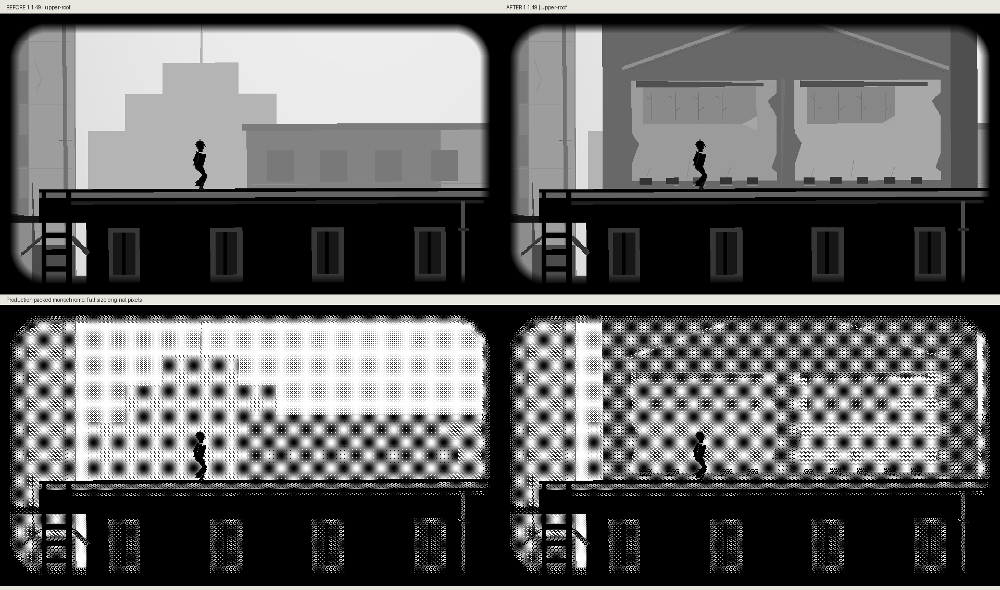
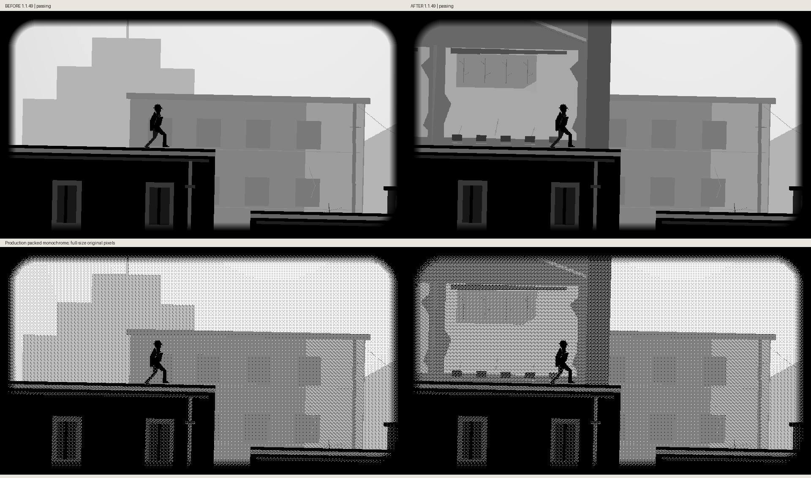

# The vanished neighboring house: actual before/after




Chapter II describes a vanished house's roof angle, empty beam holes, two pale
rooms exposed high on a wall, and wallpaper beneath a surviving ledge. These
now appear on a party wall behind the existing upper city roof. The former roof
is only a washed/flashing outline; the paper survives in a short rain shadow.
Nothing is a new window, clue, obstacle, platform or traversal destination.

The wall derives its vertical placement from city route parcel 2. Its lower
continuation is occluded by that same solid roof. The schoolroom itself,
ladder, physical roof, actor, camera, fog/rain and following crossing remain.

Baseline: public `bb6365380cba07bf055893c1289a2047797ed09a`.
The input-only route witness starts from the real city spawn, walks/climbs and
stops at x540, x725 and x860. The reached camera, actor, weather and simulation
tick are never overwritten. Before/after actor/camera/tick metadata match
exactly. The x540 schoolroom comparison is unchanged and retained as continuity
evidence; the next two captures show the new wall entering and leaving view.

Full-size original 960×540 grayscale images sit above production monochrome in
every comparison. Region copying is verified byte-for-byte; capture and source
hashes accompany the images. These are actual host game rasters, not generated
illustrations or hardware photographs. No panel-quality or device-FPS claim.

```sh
python3 scripts/preview_hollow_trail_vanished_house.py --source-root /path/to/bb636538 --output /tmp/house-before
python3 scripts/preview_hollow_trail_vanished_house.py --output /tmp/house-after --compare-before /tmp/house-before
```

Same cumulative unreleased Hollow Trail 1.1.48 → 1.1.49 update. Other missing
Chapter II beats, including the submerged street glimpse, window entry and
bedside-watch memory, remain open.
