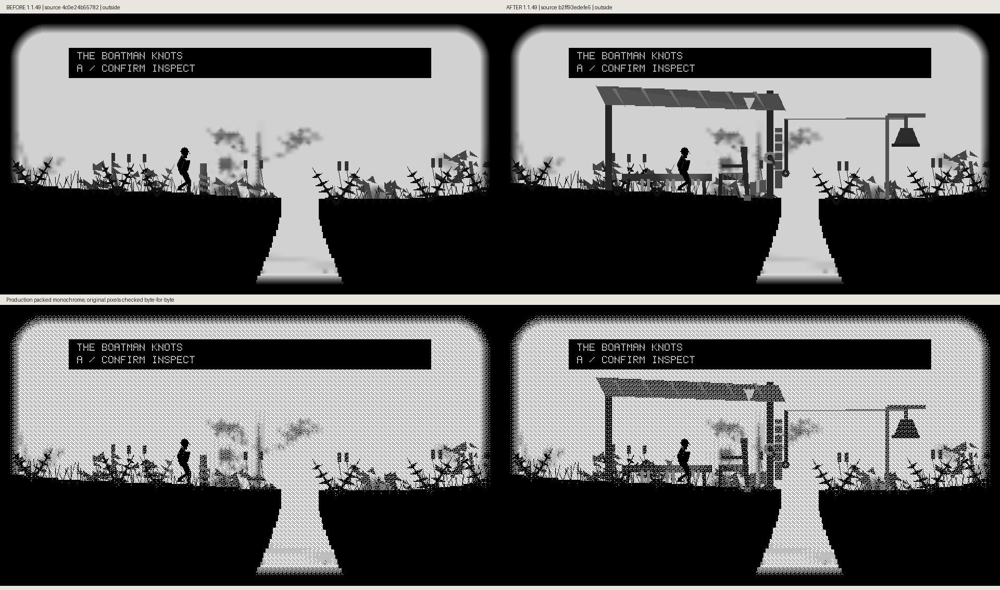
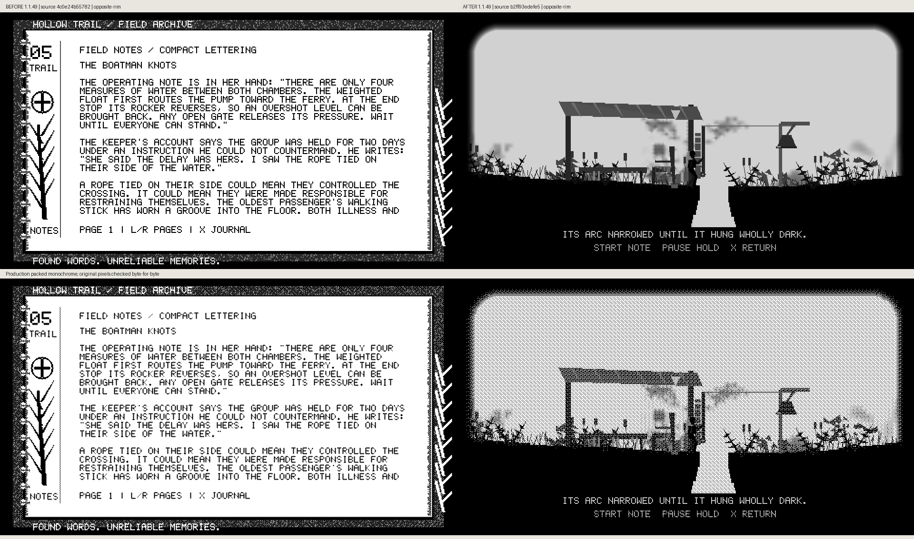

# Preserved original waiting-awning comparisons

These original grayscale/monochrome comparisons retain their actual local capture-source captions. Their pixels were recovered unchanged from the original publication records. Regenerated frames from the published source are being added separately.

