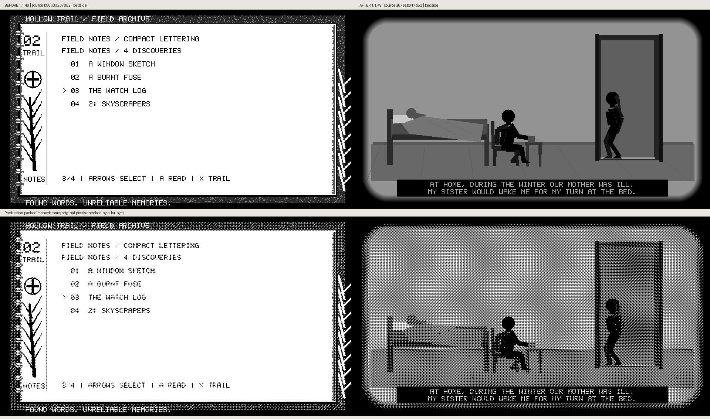
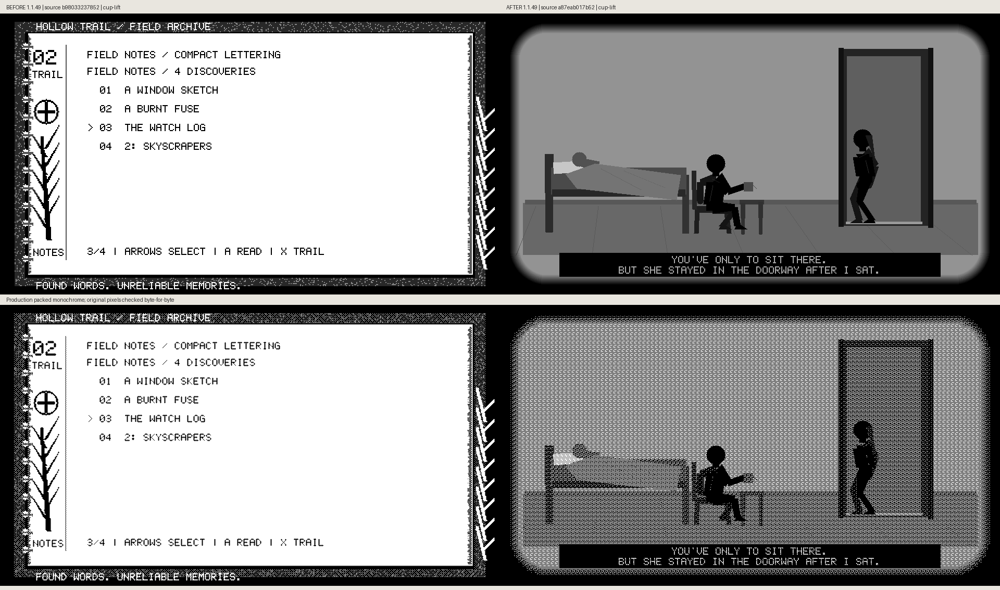
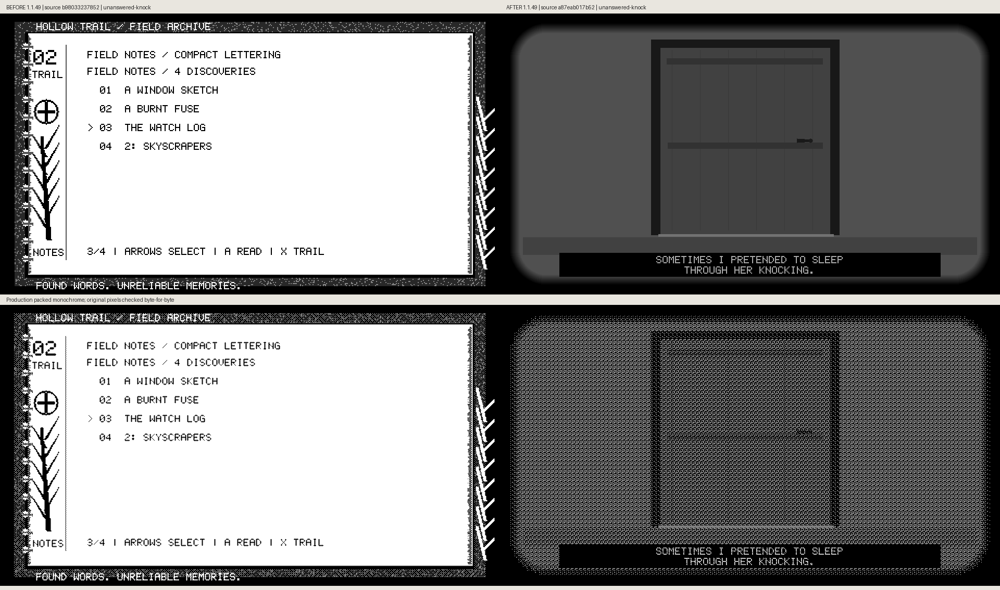
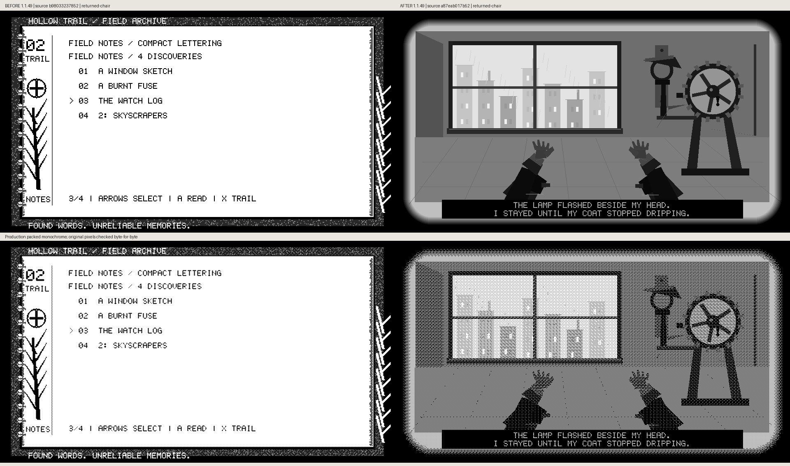

# The winter watch: actual production before/after






Baseline: public `b98033237852b5005bb95eac1a8058c45139d77d`.
After: locally captured app source `a87eab01`. Captions identify the actual
captured sources, not a released build.
Both are the cumulative unreleased 1.1.49 app version.

The input-only city route reaches the real log. Confirm opens its physical
study, Confirm opens its journal, actual Right pagination submits every page,
and Confirm on the last page completes it. The baseline then displays the
archive index. The new source earns the memory, keeps gameplay frozen and
returns to the same world anchor. This is a behavior comparison; no bedroom
scene existed in the baseline. Compact reader fallback is the actual host
fixture, not a recreated UI.

Each comparison preserves original 960×540 grayscale above and production
monochrome below. All source-file SHA-256 values, original raster hashes and
observed states are recorded. Comparison raster regions are verified
byte-for-byte. No generated artwork or hardware photo is substituted.

```sh
python3 scripts/preview_hollow_trail_watch_memory.py --source-root /path/to/b9803323 --source-ref b9803323 --output /tmp/watch-before
python3 scripts/preview_hollow_trail_watch_memory.py --source-ref a87eab01 --output /tmp/watch-after --compare-before /tmp/watch-before
```

These frames do not establish device FPS, ghosting or hardware qualification.
The baseline source, after code, raw individual captures, tested ELF/package and
publication diagnostics remain preserved separately in the working environment.

Captured source IDs above are the original local build commits, not GitHub
publication commit IDs. See [published source and provenance](../../HOLLOW_TRAIL_PUBLICATION_1_1_49.md).
